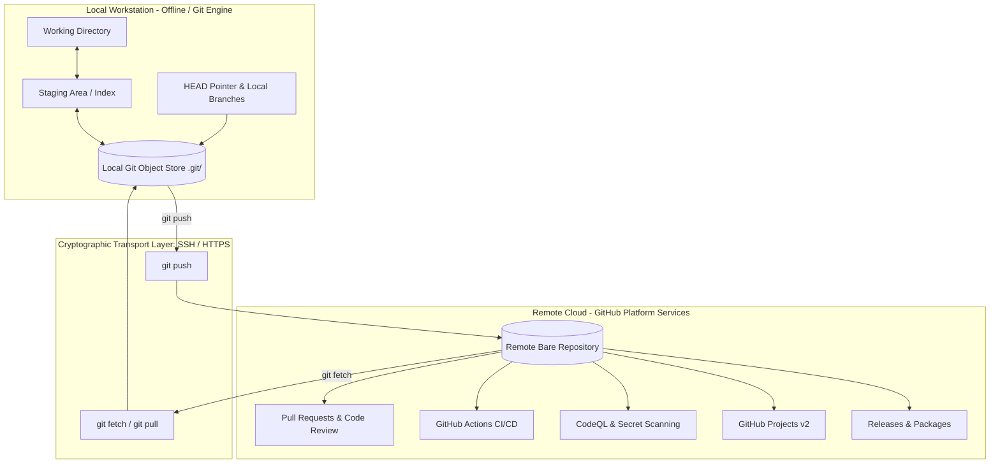

# Lesson 01: Git vs. GitHub Mental Model

---

## 1. Learning Objective
Differentiate between **Git** as a local distributed version control system (DVCS) and **GitHub** as a cloud collaboration, automation, and governance platform. Master the architectural relationship between local content-addressable storage and remote platform ecosystems.

---

## 2. Why This Matters
Many junior developers conflate Git with GitHub, believing that saving code locally requires an internet connection or that GitHub commands exist separately from Git. Understanding this boundary prevents catastrophic misconceptions around remote data synchronization, privacy, security, and repository recovery.

---

## 3. Prerequisites
- Basic familiarity with a command-line terminal (Bash, Zsh, or PowerShell).
- Text editor installed (e.g., VS Code).

---

## 4. Concept Explanation

### What is Git?
Git is a command-line tool and distributed version control engine created by Linus Torvalds in 2005.
- **Offline First**: 95% of Git operations (commits, branch creation, history inspection, diffs, log review) run entirely on your local machine with zero network latency.
- **Content-Addressable Database**: Git stores snapshots of your project as cryptographically hashed objects (blobs, trees, commits, annotated tags) indexed by 40-character SHA-1 (or SHA-256) hashes.
- **Distributed Architecture**: Every developer clone is a full-fledged repository containing the complete commit history and graph database of the project.

### What is GitHub?
GitHub is a cloud platform built on top of Git remote hosting. It provides:
1. **Collaboration Infrastructure**: Pull Requests, Code Review, Issue Tracking, GitHub Projects v2, and Discussions.
2. **Platform Automation & CI/CD**: GitHub Actions, matrix workflow runners, environment secret management.
3. **Enterprise Governance & Security**: Role-Based Access Control (RBAC), Branch Rulesets, CODEOWNERS, CodeQL (SAST), Secret Scanning, Dependabot supply chain alerts.
4. **Cloud Developer Environments**: GitHub Codespaces and Dev Containers.
5. **Distribution & Packages**: GitHub Releases and GitHub Packages (npm, Docker, Maven, NuGet, RubyGems).

---

## 5. Mental Model & Architecture Diagrams



### Architectural Comparison

| Dimension | Git (Local VCS) | GitHub (Cloud Platform) |
| :--- | :--- | :--- |
| **Core Nature** | Command-line binary / VCS Engine | Cloud platform & SaaS application |
| **Hosting / Execution** | Local workstation (`.git` directory) | Distributed cloud servers / VMs |
| **Network Dependency** | Completely offline | Requires internet connection |
| **Primary Artifact** | Directed Acyclic Graph (DAG) of commits | Pull Requests, Issues, Actions, Releases, Security alerts |
| **Key Operations** | `commit`, `branch`, `rebase`, `merge`, `checkout` | Code reviews, CI triggers, branch rulesets, issue triage |
| **Identity Mechanism** | Local config string (`user.name`, `user.email`) | Cryptographic SSH/PAT keys, SAML SSO, 2FA |

---

## 6. Real-World Use Case
An engineer working on an airplane with zero Wi-Fi can initialize repositories, create feature branches, make atomic commits, and rebase history locally using **Git**. Once landing and reconnecting to the internet, they push their branch to **GitHub** to trigger automated CI test suites, request reviews from teammates via a Pull Request, and deploy to staging.

---

## 7. Official GitHub Documentation
- [GitHub Docs: About Git and GitHub](https://docs.github.com/en/get-started/start-your-journey/about-git-and-github)
- [GitHub Docs: Setting up Git](https://docs.github.com/en/get-started/getting-started-with-git/set-up-git)
- [Pro Git Book (Official Reference)](https://git-scm.com/book/en/v2)

---

## 8. Recommended High-Quality External Resource
- **Resource**: *Git from the Inside Out* by Mary Rose Cook (Technical In-Depth Essay).
- **Why it helps**: Explains the precise data structures (blobs, trees, commits, refs) that power Git underneath, removing the mystery of local vs remote operations.

---

## 9. Step-by-Step Demonstration

### 1. Verify Local Git Execution (Zero Network Required)
```bash
# Create a local sandbox repository
mkdir git-mental-model-demo
cd git-mental-model-demo

# Initialize local Git database
git init

# Inspect the local object store (.git)
ls -la .git
```

### 2. Observe Local Snapshot Creation
```bash
# Create a file and commit it entirely locally
echo "System architecture documentation" > architecture.md
git add architecture.md
git commit -m "docs: create architecture baseline"

# Inspect the commit log locally
git log --oneline
```

### 3. Connect to GitHub Remote (Cloud Sync)
```bash
# Inspect existing remotes (initially empty)
git remote -v

# Link to a remote repository on GitHub (Transport boundary)
git remote add origin git@github.com:octocat/example-project.git
git remote -v
```

---

## 10. Hands-on Lab
Refer to [`../labs/00-environment-and-auth-lab.md`](../labs/00-environment-and-auth-lab.md) for the complete practical exercise including SSH generation and author mismatch troubleshooting.

---

## 11. Challenge
**Challenge Prompt**: If your local `.git` directory is deleted from your project folder, what happens to your uncommitted changes in your working directory, and what happens to your project history? If the repository was previously pushed to GitHub, how do you restore your history?
*(Solution: Working directory files remain intact. Local history is lost. You can restore committed history by cloning fresh from GitHub: `git clone <remote-url>`)*.

---

## 12. Common Mistakes & Gotchas
- **Mistake 1**: Assuming `git commit` uploads code to GitHub. (*Reality: `git commit` only writes to local `.git/`. `git push` is required to transfer objects to GitHub.*)
- **Mistake 2**: Believing changing `user.name` and `user.email` in Git authenticates you with GitHub. (*Reality: Git config identity is merely an unverified metadata label; SSH keys or Personal Access Tokens handle authentication.*)
- **Mistake 3**: Committing secrets locally and thinking they are safe because you didn't push. (*Reality: If you later push, the secret exists in the permanent commit history.*)

---

## 13. Professional Practices
- **Atomic Local Commits**: Commit early and often locally while developing; use interactive rebase to clean up history before pushing to GitHub.
- **Descriptive Remote Naming**: Use standard remote names (`origin` for your fork/primary repo, `upstream` for the canonical open-source source).
- **Zero Secrets Locally**: Configure pre-commit hooks to block sensitive strings from entering the local `.git` object store.

---

## 14. Security Considerations
- **Metadata Spoofing**: Anyone can configure `git config user.email "torvalds@linux-foundation.org"` and create commits appearing to be Linus Torvalds.
- **GitHub Verification**: Always enable **GPG or SSH Commit Signing** so GitHub displays the cryptographic **Verified** badge.

---

## 15. Interview Questions & Progression

1. **[WHAT]**: What is the difference between Git and GitHub?
   - *Answer*: Git is a distributed VCS tool that tracks file changes locally; GitHub is a cloud hosting platform providing collaboration, CI/CD, and repository management.
2. **[HOW]**: How does Git communicate with GitHub over the network?
   - *Answer*: Via SSH (`git@github.com:...`) using public-key cryptography or HTTPS using Personal Access Tokens (PATs).
3. **[WHY]**: Why does Git allow working completely offline while SVN or Perforce traditional VCS did not?
   - *Answer*: Git stores the entire repository history and DAG graph locally in `.git/`, whereas centralized systems require continuous connection to a central server.
4. **[WHAT IF]**: What happens if GitHub goes down while your team is in the middle of a release sprint?
   - *Answer*: Developers continue committing, branching, and merging locally. Once GitHub recovers, branches and tags are pushed.
5. **[TRADE-OFFS]**: What are the trade-offs of hosting Git repositories on GitHub vs. self-hosting GitLab/Gitea?
   - *Answer*: GitHub provides managed uptime, global developer ecosystem, and integrated security/Copilot at the cost of SaaS vendor lock-in and per-seat pricing.

---

## 16. Real-World Scenario
A banking software team has strict compliance rules prohibiting cloud code execution. They use **Git** on isolated on-premise development machines. For their open-source SDKs, they mirror sanitized branches to **GitHub** to leverage GitHub Actions and GitHub Releases for public distribution.

---

## 17. Assessment
Complete the diagnostic questions in [`../assessments/00-foundations-assessment.md`](../assessments/00-foundations-assessment.md).

---

## 18. Mastery Criteria
- [ ] Can clearly explain the Git vs GitHub boundary without confusing local vs remote operations.
- [ ] Understands the role of `.git` as a local database.
- [ ] Understands why Git commit author metadata is not an authentication credential.

---

## 19. Further Exploration
- Explore the internal directory structure of `.git/objects`, `.git/refs`, and `.git/HEAD`.
- Research Git 2.38+ features including `scalar` and partial clone capabilities for monorepos.
