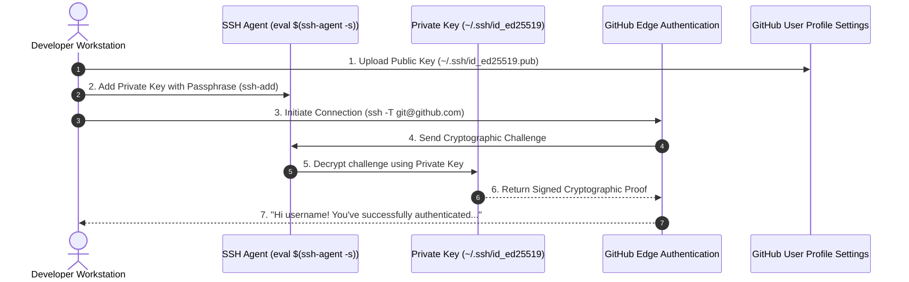

# Lesson 02: Developer Environment & SSH Authentication

---

## 1. Learning Objective
Configure a professional, production-grade local developer environment with Git global defaults, modern **Ed25519 SSH keypair** authentication, SSH agent management, and cryptographic **SSH commit signing**.

---

## 2. Why This Matters
Insecure or misconfigured developer workstations lead to authentication lockouts, leaky credentials, line-ending corruption across OS boundaries, and unsigned commits that fail enterprise branch protection rulesets. Setting up Ed25519 keys and signed commits establishes an unshakeable security foundation.

---

## 3. Prerequisites
- Terminal environment (macOS/Linux/WSL2/PowerShell).
- Git `2.34+` installed (for native SSH commit signing support).
- An active GitHub account with Two-Factor Authentication (2FA) enabled.

---

## 4. Concept Explanation

### The Git Configuration Hierarchy
Git resolves configuration values in a 4-level precedence cascade (from lowest to highest priority):
1. **System** (`/etc/gitconfig`): Applied to all users on the OS.
2. **Global** (`~/.gitconfig` or `~/.config/git/config`): Applied to all repositories for the current user.
3. **Local** (`.git/config` within a specific repository): Overrides global settings for that specific project.
4. **Worktree** (`.git/config.worktree`): Project-specific worktree overrides.

### Why Ed25519 over RSA?
- **RSA 2048/4096**: Older standard, larger key size, slower key generation, prone to legacy padding attacks if configured improperly.
- **Ed25519**: Modern elliptic-curve algorithm (`Curve25519`), fixed 256-bit key size, immune to timing attacks, highly performant, and the modern standard recommended by GitHub and OpenSSH.

### Modern Commit Signing via SSH
Traditionally, signing commits required complex GPG key management. Since Git `2.34+`, Git supports signing commits directly using your existing **SSH keys** (`gpg.format = ssh`), providing verified cryptographic tamper resistance without GPG overhead.

---

## 5. Mental Model & Authentication Flow



---

## 6. Real-World Use Case
Enterprise organizations enforce **Branch Protection Rulesets** that reject any Pull Request containing unsigned commits. By configuring SSH commit signing globally, every commit you make is automatically signed with your hardware-backed or passphrase-protected SSH key, ensuring compliance and preventing commit spoofing.

---

## 7. Official GitHub Documentation
- [GitHub Docs: Connecting to GitHub with SSH](https://docs.github.com/en/authentication/connecting-to-github-with-ssh)
- [GitHub Docs: Generating a new SSH key and adding it to the ssh-agent](https://docs.github.com/en/authentication/connecting-to-github-with-ssh/generating-a-new-ssh-key-and-adding-it-to-the-ssh-agent)
- [GitHub Docs: Signing commits with SSH keys](https://docs.github.com/en/authentication/managing-commit-signature-verification/signing-commits)

---

## 8. Recommended High-Quality External Resource
- **Resource**: *OpenSSH Ed25519 Key Generation Guidelines* (OpenSSH Manual & GitHub Security Blog).
- **Why it helps**: Details why modern elliptic-curve signatures provide better security and performance than legacy RSA keys.

---

## 9. Step-by-Step Demonstration

### 1. Configure Essential Global Git Defaults
```bash
# 1. Identity configuration
git config --global user.name "Your Full Name"
git config --global user.email "your-github-verified-email@example.com"

# 2. Modern default branch name
git config --global init.defaultBranch main

# 3. Predictable pull behavior (prevent accidental merge commits)
git config --global pull.rebase false

# 4. Consistent line ending handling
# On macOS / Linux:
git config --global core.autocrlf input
# On Windows:
# git config --global core.autocrlf true

# 5. Set default text editor
git config --global core.editor "code --wait"
```

### 2. Generate Modern Ed25519 SSH Keypair
```bash
# Generate key with comment matching your GitHub email
ssh-keygen -t ed25519 -C "your-github-verified-email@example.com" -f ~/.ssh/id_ed25519

# Start ssh-agent in background
eval "$(ssh-agent -s)"

# Add private key to agent
ssh-add ~/.ssh/id_ed25519
```

### 3. Add Public Key to GitHub
```bash
# View public key (NEVER share the private key without .pub)
cat ~/.ssh/id_ed25519.pub

# Copy and add to GitHub: Settings -> SSH and GPG Keys -> New SSH Key
# Or add directly using GitHub CLI:
gh ssh-key add ~/.ssh/id_ed25519.pub --title "Dev Workstation Ed25519"
```

### 4. Configure Modern SSH Commit Signing
```bash
# Tell Git to use SSH for signing
git config --global gpg.format ssh

# Set your public SSH key as the signing key
git config --global user.signingkey ~/.ssh/id_ed25519.pub

# Enable automatic signing on all commits
git config --global commit.gpgsign true
```

### 5. Verify Authentication & Test Signed Commit
```bash
# Test connection against GitHub
ssh -T git@github.com

# Create signed commit
git commit -S -m "feat: setup verified developer workstation"

# Verify signature locally
git log --show-signature -1
```

---

## 10. Hands-on Lab
Proceed to [`../labs/00-environment-and-auth-lab.md`](../labs/00-environment-and-auth-lab.md) for the guided Break/Fix lab.

---

## 11. Challenge
**Challenge**: Configure conditional Git configurations using `includeIf` so that repositories in `~/work/` automatically use your work email and work SSH key, while repositories in `~/personal/` use your personal credentials.

---

## 12. Common Mistakes & Gotchas
- **Mistake 1**: Uploading the private key (`id_ed25519`) instead of the public key (`id_ed25519.pub`). (*Danger: Compromises your cryptographic identity.*)
- **Mistake 2**: Leaving the passphrase empty when generating SSH keys. (*Risk: If your laptop is compromised, your private key is immediately accessible without a password.*)
- **Mistake 3**: Line ending mismatch errors (`CRLF` vs `LF`) causing full-file diffs. (*Fix: Configure `core.autocrlf` correctly.*)

---

## 13. Professional Practices
- **SSH Config Multiplexing**: Configure `~/.ssh/config` for clean host aliases and identity file mappings.
- **Key Rotation**: Rotate SSH keys annually or immediately upon hardware retirement.
- **Separate Auth and Signing Keys**: Use a dedicated signing key type in enterprise environments if mandated by compliance.

---

## 14. Security Considerations
- **Private Key Permissions**: Ensure private key file permissions are strictly restricted (`chmod 600 ~/.ssh/id_ed25519` and `chmod 700 ~/.ssh`).
- **Passphrase Caching**: Use OS keychain integrations (e.g., Apple Keychain or Windows Credential Manager) instead of disabling passphrases.

---

## 15. Interview Questions & Progression

1. **[WHAT]**: What is the difference between an SSH Authentication Key and an SSH Signing Key on GitHub?
   - *Answer*: Authentication keys grant read/write access to repositories via SSH transport; Signing keys verify cryptographic commit provenance and award the "Verified" badge.
2. **[HOW]**: How do you troubleshoot `Permission denied (publickey)` when running `git push`?
   - *Answer*: Run `ssh -Tv git@github.com` to inspect which keys are offered by `ssh-agent` and match against GitHub profile settings.
3. **[WHY]**: Why is Ed25519 preferred over RSA for modern developer keypairs?
   - *Answer*: Ed25519 provides stronger security per bit, smaller key footprints, higher signing performance, and resistance to side-channel timing attacks.
4. **[WHAT IF]**: What happens if your commit author email does not match any email on your GitHub account?
   - *Answer*: The commit is stored in the Git history, but GitHub will display an unlinked avatar and cannot award the verified badge.
5. **[TRADE-OFFS]**: What are the trade-offs of using HTTPS + Fine-Grained PATs vs. SSH Keys for daily developer workflow?
   - *Answer*: SSH keys offer permanent, passphrase-secured authentication without expiration hassles; Fine-grained PATs offer precise repository-level permissions and expiration windows required in zero-trust environments.

---

## 16. Real-World Scenario
A developer joins a new team and pushes 20 commits to a repository. All 20 commits display a generic grey avatar and an "Unverified" tag because their local `user.email` was set to an old university email, and commit signing was disabled. The developer must reconfigure their global Git identity, configure SSH signing, and use interactive rebase to update commit author metadata.

---

## 17. Assessment
Complete the evaluation in [`../assessments/00-foundations-assessment.md`](../assessments/00-foundations-assessment.md).

---

## 18. Mastery Criteria
- [ ] Ed25519 keypair successfully generated with a strong passphrase.
- [ ] `ssh -T git@github.com` returns successful authentication message.
- [ ] Commits are cryptographically signed with `-S` and verified via `git log --show-signature`.
- [ ] Global Git defaults (`init.defaultBranch`, `core.autocrlf`, `core.editor`) configured.

---

## 19. Further Exploration
- Research SSH certificate authorities (SSH CAs) used in enterprise organizations.
- Explore hardware security keys (FIDO2 / YubiKey) with `ssh-keygen -t ed25519-sk`.
