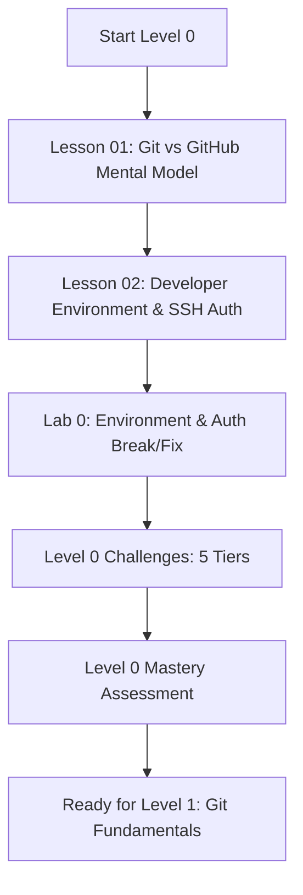

# Level 0 — Foundation & GitHub Mental Model

> **Establish the architectural mental models, cryptographic identity, and local developer environment required for professional Git & GitHub engineering.**

---

## 🎯 Level Objectives

By the end of this foundational level, you will:
1. Understand the structural and operational boundaries between **Git** (local, content-addressable version control system) and **GitHub** (cloud collaboration platform, CI/CD engine, and developer ecosystem).
2. Configure your local Git identity, global defaults (`init.defaultBranch`, `core.editor`, `pull.rebase`), and line ending behavior correctly across operating systems.
3. Generate, secure, and provision modern **Ed25519 SSH keys** for passwordless, cryptographically authenticated interaction with GitHub.
4. Understand commit verification and configure cryptographic signing for tamper-evident commits.
5. Diagnose and recover from authentication failures (`Permission denied (publickey)`), key mismatches, and detached author configurations.

---

## 🗺️ Module Curriculum & Roadmap

### Lessons & Materials

| # | Document | Topic & Focus | Depth |
| :---: | :--- | :--- | :---: |
| **01** | [`01-git-vs-github-mental-model.md`](01-git-vs-github-mental-model.md) | Distributed VCS Architecture vs. Cloud Platform Services | Beginner $\to$ Pro |
| **02** | [`02-developer-environment-ssh-auth.md`](02-developer-environment-ssh-auth.md) | Local Config, Ed25519 Cryptography, SSH Agent, Verified Commits | Beginner $\to$ Pro |
| **Lab** | [`../labs/00-environment-and-auth-lab.md`](../labs/00-environment-and-auth-lab.md) | Practical Lab with SSH Authentication & Author Email Break/Fix | Hands-On |
| **Chal** | [`../challenges/00-foundations-challenges.md`](../challenges/00-foundations-challenges.md) | 5-Tier Challenge (Multi-account SSH, Environment Doctoring) | Tier 1–5 |
| **Quiz** | [`../assessments/00-foundations-assessment.md`](../assessments/00-foundations-assessment.md) | Diagnostic Assessment, Scenarios & Mastery Rubric | Evaluation |

---

## 🧠 Key Mental Models in this Level

### 1. Git (Local Engine) vs. GitHub (Platform Ecosystem)
- **Git** is a distributed, offline, content-addressable storage engine operating on a directed acyclic graph (DAG) of immutable commit objects.
- **GitHub** is an orchestration, identity, and governance platform built on top of Git remotes, providing pull requests, code review, automated CI/CD runners, secret scanning, security alerts, and package distribution.

### 2. Cryptographic Developer Identity
- Git commits contain arbitrary, unverified metadata strings for `author` and `committer`.
- GitHub uses your configured public SSH/GPG keys to prove repository write authorization and cryptographic commit provenance (the **Verified** badge).

---

## ✅ Level 0 Mastery Checklist

Before advancing to [Level 1: Git Fundamentals](../01-git-fundamentals/), verify you can:
- [ ] Articulate the exact boundary between local Git operations and GitHub platform services.
- [ ] Inspect and modify global/system/local Git configuration hierarchies (`git config --list --show-origin`).
- [ ] Generate an Ed25519 SSH keypair with a strong passphrase and load it into your background SSH agent.
- [ ] Authenticate against GitHub securely via `ssh -T git@github.com`.
- [ ] Diagnose and resolve an SSH `Permission denied (publickey)` error without destroying existing keys.
- [ ] Complete the [Level 0 Assessment](../assessments/00-foundations-assessment.md) with 100% score.
