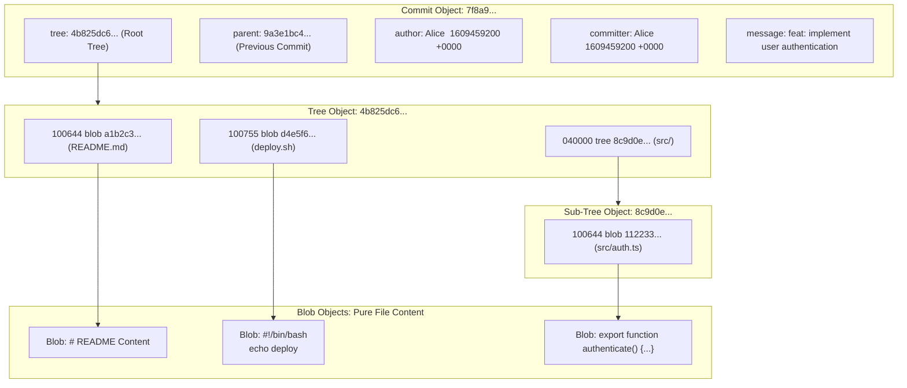

# Lesson 02: The Git Object Database & Low-Level Plumbing

---

## 1. Learning Objective
Master Git's internal storage engine as a **content-addressable object database**. Understand the 4 core immutable object primitives (**Blobs**, **Trees**, **Commits**, and **Tags**), SHA hashing, zlib compression, and construct commits purely via low-level **Plumbing Commands**.

---

## 2. Why This Matters
Porcelain commands (`git add`, `git commit`, `git checkout`) hide Git's simple, elegant data structures behind high-level abstractions. When repository corruption, rebasing errors, or merge conflicts occur, developers who understand Git's object model can effortlessly diagnose, inspect, and repair repository states.

---

## 3. Prerequisites
- Completed [Lesson 01: The Three-Tree Architecture](01-three-trees-and-git-architecture.md).
- Command-line tools: `git`, `cat`, `echo`, `openssl` (or `shasum`).

---

## 4. Concept Explanation

### Git as a Content-Addressable Key-Value Store
At its core, Git is a simple key-value database located in `.git/objects/`.
- **Key**: A 40-character hexadecimal string generated by taking the cryptographic **SHA-1** (or 64-character **SHA-256**) hash of the object header plus its content.
- **Value**: Compressed raw bytes (compressed using `zlib`).

### The 4 Immutable Object Primitives



1. **Blob (Binary Large Object)**:
   - Stores pure file content.
   - Does **NOT** store filename, timestamps, or file permissions.
2. **Tree Object**:
   - Equivalent to a directory.
   - Stores directory listings: file mode (`100644` for standard file, `100755` for executable, `040000` for subdirectory), object type (`blob` or `tree`), SHA-1 hash, and the filename.
3. **Commit Object**:
   - Points to a top-level Tree object representing the root directory snapshot.
   - Points to zero, one, or multiple parent commit hashes.
   - Stores author/committer metadata, timestamp, and the commit message.
4. **Annotated Tag Object**:
   - A permanent reference pointing to a specific commit object with tagger metadata, message, and optional cryptographic GPG/SSH signature.

### How Git Computes Object Hashes
Git prefixes content with a header before hashing:
$$\text{Header} = \text{type} + \text{" "} + \text{size\_in\_bytes} + \text{"\textbackslash 0" (null byte)}$$
$$\text{SHA-1 Hash} = \text{SHA1}(\text{Header} + \text{Content})$$

---

## 5. Mental Model: The Object Filesystem Hierarchy

In `.git/objects/`, the first 2 characters of the 40-character SHA hash become the directory name, and the remaining 38 characters become the filename:

```text
.git/objects/
├── 4b/
│   └── 825dc642cb6eb9a060e54bf8d69288fbee4904   <-- Tree object
├── a1/
│   └── b2c3d4e5f6...                              <-- Blob object
├── 7f/
│   └── 8a9b0c...                                  <-- Commit object
├── info/
└── pack/                                          <-- Compressed packfiles
```

---

## 6. Real-World Use Case
Understanding object hashing explains why Git deduplicates data globally across branches. If two files in different directories (or different branches) have the exact same contents, Git creates only **ONE** blob object in `.git/objects/`. Renaming a file creates zero new blobs—only a new tree entry pointing to the existing blob hash!

---

## 7. Official GitHub Documentation
- [Pro Git Book: Git Internals - Git Objects](https://git-scm.com/book/en/v2/Git-Internals-Git-Objects)
- [Pro Git Book: Git Internals - Plumbing and Porcelain](https://git-scm.com/book/en/v2/Git-Internals-Plumbing-and-Porcelain)

---

## 8. Recommended High-Quality External Resource
- **Resource**: *Git Under the Hood: Object Storage Mechanics* by Tim Berglund.
- **Why it helps**: Live terminal visualization of `.git/objects` and tree creation.

---

## 9. Step-by-Step Demonstration: Building a Commit Purely with Plumbing

Let's construct a complete Git commit without using `git add` or `git commit`!

### 1. Initialize Bare Sandbox
```bash
mkdir plumbing-demo && cd plumbing-demo
git init
```

### 2. Create a Blob via `git hash-object`
```bash
# Write content directly to the object store
BLOB_HASH=$(echo "Hello, Git Plumbing!" | git hash-object -w --stdin)
echo "Blob Hash: $BLOB_HASH"

# Inspect the object type and contents
git cat-file -t $BLOB_HASH    # Output: blob
git cat-file -p $BLOB_HASH    # Output: Hello, Git Plumbing!
```

### 3. Add Blob into the Index via `git update-index`
```bash
# Register the blob in the staging index with mode 100644 (regular file)
git update-index --add --cacheinfo 100644 $BLOB_HASH "greeting.txt"

# Inspect the staged index entries
git ls-files --stage
```

### 4. Write the Index into a Tree Object via `git write-tree`
```bash
# Convert staging area into an immutable tree object
TREE_HASH=$(git write-tree)
echo "Tree Hash: $TREE_HASH"

# Inspect tree contents
git cat-file -t $TREE_HASH    # Output: tree
git cat-file -p $TREE_HASH    # Output: 100644 blob <blob-hash> greeting.txt
```

### 5. Create a Commit Object via `git commit-tree`
```bash
# Write commit object pointing to the tree
COMMIT_HASH=$(echo "feat: create first commit with plumbing" | git commit-tree $TREE_HASH)
echo "Commit Hash: $COMMIT_HASH"

# Inspect commit object
git cat-file -t $COMMIT_HASH  # Output: commit
git cat-file -p $COMMIT_HASH  # Output: tree, author, committer, message
```

### 6. Point Branch Ref to Commit via `git update-ref`
```bash
# Update main branch ref
git update-ref refs/heads/main $COMMIT_HASH

# Now standard porcelain commands work seamlessly!
git log -1 --stat
git status
```

---

## 10. Hands-on Lab
Refer to [`../labs/01-git-plumbing-and-recovery-lab.md`](../labs/01-git-plumbing-and-recovery-lab.md).

---

## 11. Challenge
**Challenge**: Manually calculate the exact SHA-1 hash of a file containing the string `"test content\n"` using standard Unix shell tools (`printf`, `shasum` or `openssl sha1`) and prove that it matches `git hash-object`.

---

## 12. Common Mistakes & Gotchas
- **Mistake 1**: Expecting `git cat-file` to work on file paths. (*Reality: `git cat-file` operates on SHA object hashes, not file paths.*)
- **Mistake 2**: Modifying raw files inside `.git/objects/` with a text editor. (*Danger: Corrupts the zlib compression and breaks the hash integrity of the repository.*)
- **Mistake 3**: Assuming renaming a file creates a large storage footprint. (*Reality: Git only creates a new tree object; the underlying blob is shared identically.*)

---

## 13. Professional Practices
- **Use `git fsck` for Database Health**: Regularly verify repository integrity with `git fsck --full`.
- **Deduplication Awareness**: Commit large binary assets carefully—minor changes in binaries generate brand new 100% size blobs since binaries do not delta-compress cleanly.

---

## 14. Security Considerations
- **SHA-1 Collision Mitigation**: Modern Git uses **Sha1DC** (Collision-Detecting SHA-1) and supports transition to **SHA-256** object formats (`git init --object-format=sha256`) to resist hash collision attacks.

---

## 15. Interview Questions & Progression

1. **[WHAT]**: What are the four core object types in Git?
   - *Answer*: Blob (file content), Tree (directory snapshot & metadata), Commit (tree pointer, parent pointer, author info, message), and Tag (annotated tag metadata).
2. **[HOW]**: How does Git know what filename is associated with a blob?
   - *Answer*: Filenames are stored inside parent **Tree** objects, not inside the Blob itself.
3. **[WHY]**: Why are Git objects considered immutable?
   - *Answer*: Any change to an object's content alters its SHA hash, which changes its key and forces new parent trees and commits to be generated.
4. **[WHAT IF]**: What happens if two files in different directories have identical contents?
   - *Answer*: Git stores exactly one blob object and references its single SHA hash across multiple tree objects.
5. **[TRADE-OFFS]**: What are the trade-offs of Git storing full snapshots vs. delta diffs like SVN?
   - *Answer*: Snapshots make branching, merging, and checkout operations instantaneous at the cost of disk space, which Git optimizes using packfiles.

---

## 16. Real-World Scenario
A deployment script running in an automated CI container needs to tag a release and record build artifacts without checking out working tree files to disk. By using `git hash-object`, `git mktree`, and `git commit-tree`, the CI pipeline generates and pushes verified commit objects in sub-second time with zero filesystem disk I/O overhead.

---

## 17. Assessment
Complete the evaluation in [`../assessments/01-git-fundamentals-assessment.md`](../assessments/01-git-fundamentals-assessment.md).

---

## 18. Mastery Criteria
- [ ] Can name and diagram the 4 Git object types and their relationship.
- [ ] Understands the Git SHA header formatting structure.
- [ ] Successfully constructs a commit from raw bytes using plumbing commands.
- [ ] Can inspect any object using `git cat-file -t`, `-s`, and `-p`.

---

## 19. Further Exploration
- Explore Git Packfiles (`.git/objects/pack/`) and index files (`.idx`) using `git verify-pack -v`.
- Explore `git mktree` for constructing nested directory hierarchies from raw text definitions.
