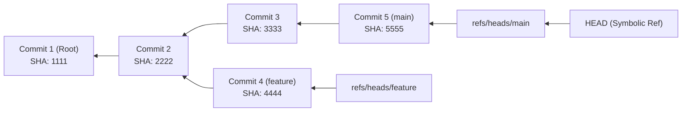
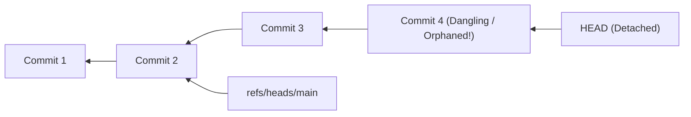
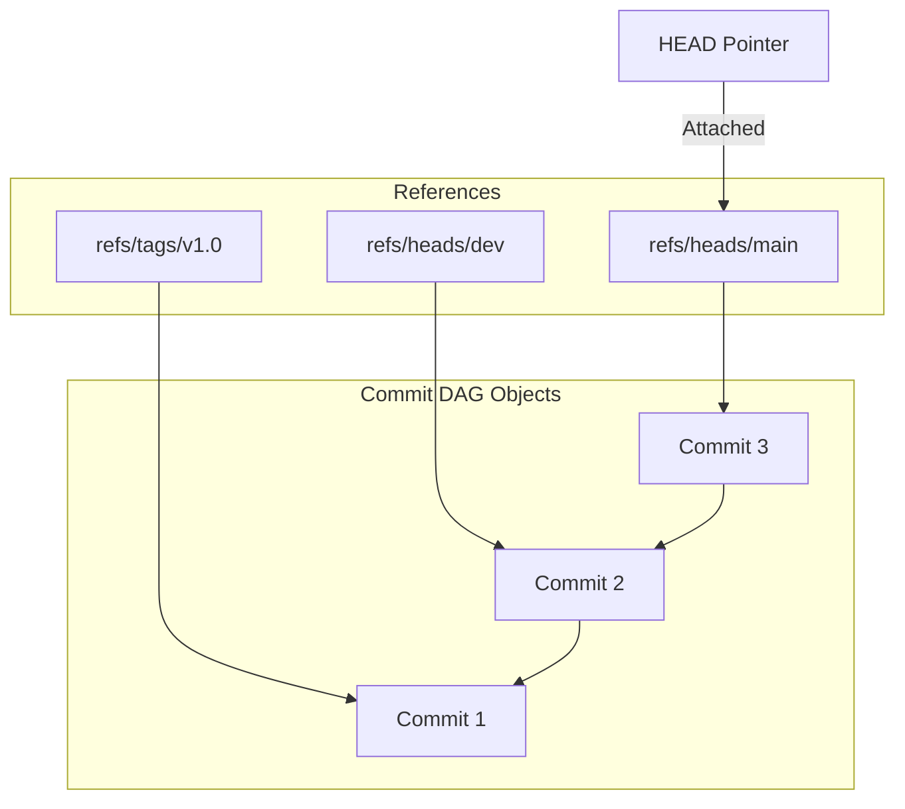

# Lesson 03: The DAG, References, HEAD & The Reflog Safety Net

---

## 1. Learning Objective
Master Git's **Directed Acyclic Graph (DAG)** topology, understand direct and symbolic **References** (`.git/refs/`), demystify the **Detached HEAD** state, and learn how to resurrect orphaned commits using **`git reflog`** and **`git fsck`**.

---

## 2. Why This Matters
"I lost my branch!", "I'm in detached HEAD and my commits vanished!", and "I made a bad rebase and lost 3 days of work!" are among the most common panic moments in software engineering. Understanding the DAG and `git reflog` transforms panic into routine, confident 30-second recovery operations.

---

## 3. Prerequisites
- Completed [Lesson 02: The Git Object Database & Plumbing](02-git-object-database-plumbing.md).
- Understanding of commit and tree objects.

---

## 4. Concept Explanation

### The Directed Acyclic Graph (DAG)
Git commit history is not a linear array—it is a **Directed Acyclic Graph (DAG)**:
- **Directed**: Edges point in one direction (each child commit points backward to its parent commit SHA).
- **Acyclic**: The graph cannot loop back onto itself (a commit cannot be an ancestor of itself).
- **Graph**: Multiple branches and merge points branch out and rejoin arbitrarily.



### Direct References vs. Symbolic References
- **Direct References (`refs/heads/*`, `refs/tags/*`)**: Simple text files in `.git/refs/` that contain a 40-character commit SHA.
  - E.g. `cat .git/refs/heads/main` $\to$ `5555...`
- **Symbolic References (`HEAD`)**: A special reference in `.git/HEAD` that points to *another reference* rather than directly to a commit hash.
  - Standard state: `cat .git/HEAD` $\to$ `ref: refs/heads/main`

### What is the "Detached HEAD" State?
When you check out a specific commit hash, remote branch, or tag directly:
```bash
git checkout 3333
```
Git writes the commit SHA directly into `.git/HEAD` instead of a branch reference:
`cat .git/HEAD` $\to$ `3333...`



> [!WARNING]
> If you create commits while in Detached HEAD and then switch back to `main` (`git checkout main`), the commits you created (e.g. `C4`) are **no longer referenced by any branch**. They become **Dangling Commits**.

### The Ultimate Safety Net: `git reflog`
Git maintains a local append-only log of every single time `HEAD` or a branch reference moves (via commit, checkout, rebase, merge, or reset).
- Recorded in `.git/logs/HEAD`.
- By default, reflog entries are preserved for **30 to 90 days** before garbage collection (`git gc`).
- Even if a branch is force-deleted, its commits remain recoverable through the reflog!

---

## 5. Mental Model: The Reference Pointer Web



---

## 6. Real-World Use Case
A developer accidentally runs `git reset --hard HEAD~5` and loses 5 commits containing critical sprint features. Because Git never deletes commits immediately, running `git reflog` reveals `HEAD@{1}` pointing to the commit SHA before the reset. Running `git reset --hard HEAD@{1}` restores all 5 commits in under 5 seconds with zero data loss.

---

## 7. Official GitHub Documentation
- [Pro Git Book: Git Branching - Branches in a Nutshell](https://git-scm.com/book/en/v2/Git-Branching-Branches-in-a-Nutshell)
- [Pro Git Book: Git Internals - Git References](https://git-scm.com/book/en/v2/Git-Internals-Git-References)
- [Pro Git Book: Git Tools - Undoing Things (Reflog)](https://git-scm.com/book/en/v2/Git-Tools-Revision-Selection)

---

## 8. Recommended High-Quality External Resource
- **Resource**: *Visualizing Git Concepts with D3* by CS Visualized.
- **Why it helps**: Interactive real-time animation of DAG branch movement and HEAD pointer re-targeting.

---

## 9. Step-by-Step Demonstration

### 1. Inspect Reference Internals
```bash
mkdir dag-demo && cd dag-demo
git init
echo "init" > file.txt && git add file.txt && git commit -m "c1"
echo "v2" >> file.txt && git commit -am "c2"

# Inspect HEAD content
cat .git/HEAD
# Output: ref: refs/heads/main

# Inspect main branch pointer
cat .git/refs/heads/main
# Output: <40-char-sha-of-c2>
```

### 2. Enter Detached HEAD & Create Orphaned Commits
```bash
# Get SHA of C1
C1_SHA=$(git rev-parse HEAD~1)

# Check out C1 directly
git checkout $C1_SHA
# Git warning: You are in 'detached HEAD' state...

# Check .git/HEAD again
cat .git/HEAD
# Output is now the raw SHA of C1!

# Make a commit in detached HEAD
echo "feature in limbo" > limbo.txt
git add limbo.txt
git commit -m "c3: detached experimental feature"
ORPHAN_SHA=$(git rev-parse HEAD)
```

### 3. "Lose" the Commit by Switching Branches
```bash
git checkout main
# Git warns: Warning: you are leaving 1 commit behind, not connected to any of your branches...

# c3 is not in git log!
git log --oneline
```

### 4. Rescue the Orphaned Commit via Reflog
```bash
# Inspect the reflog
git reflog
# Output: <sha> HEAD@{1}: commit: c3: detached experimental feature

# Resurrect the commit into a named branch
git branch rescued-feature $ORPHAN_SHA

# Verify branch is intact!
git checkout rescued-feature
git log --oneline -2
```

---

## 10. Hands-on Lab
Refer to [`../labs/01-git-plumbing-and-recovery-lab.md`](../labs/01-git-plumbing-and-recovery-lab.md).

---

## 11. Challenge
**Challenge**: Use `git fsck --lost-found` to locate dangling commit objects in a repository where the reflog has been expired (`git reflog expire --expire=now --all`).

---

## 12. Common Mistakes & Gotchas
- **Mistake 1**: Panicking in detached HEAD and deleting the local repository. (*Fix: Just create a branch where you stand: `git switch -c new-branch`*).
- **Mistake 2**: Believing branches are heavy directory copies. (*Reality: A branch in Git is literally a 41-byte text file containing a 40-character SHA string and a newline.*).
- **Mistake 3**: Assuming `git branch -D` deletes commit objects immediately. (*Reality: It only deletes the reference file in `.git/refs/heads/`; the commit DAG remains intact in the reflog.*).

---

## 13. Professional Practices
- **Never Work Directly in Detached HEAD**: If you check out an older commit to test something, immediately spawn a scratch branch (`git switch -c temp-investigation`).
- **Use `git switch` and `git restore` (Git 2.23+)**: Replace ambiguous `git checkout` with `git switch` (for branches) and `git restore` (for files).

---

## 14. Security Considerations
- **Orphaned Secrets in Reflog**: If a developer commits an unencrypted API secret and then runs `git reset --hard HEAD~1`, the secret commit is still fully accessible in `.git/logs/` and `.git/objects/`. A repository sweep or secret rotation is still mandatory!

---

## 15. Interview Questions & Progression

1. **[WHAT]**: What is a symbolic reference in Git?
   - *Answer*: A reference that points to another reference (such as `HEAD` pointing to `refs/heads/main`) rather than directly to a commit hash.
2. **[HOW]**: What happens under the hood when you run `git branch feature-auth`?
   - *Answer*: Git creates a new 41-byte file at `.git/refs/heads/feature-auth` containing the exact commit SHA that `HEAD` is currently pointing to.
3. **[WHY]**: Why is Git commit history described as a Directed Acyclic Graph (DAG)?
   - *Answer*: Because commits contain directional parent pointers pointing backward to ancestor commits, and history can never form a closed loop.
4. **[WHAT IF]**: What happens to dangling commits if they are never attached to a branch?
   - *Answer*: They remain in `.git/objects/` until `git gc` runs (typically after 30-90 days), at which point they are pruned.
5. **[TRADE-OFFS]**: What are the trade-offs of Git's reflog existing only locally vs. being pushed to GitHub remotes?
   - *Answer*: Local-only reflogs protect privacy and allow developers to experiment freely, but remote disasters (e.g. force-pushed remotes) require GitHub audit logs or local mirrors to recover.

---

## 16. Real-World Scenario
During a production release hotfix, a developer mistakenly executes `git branch -D hotfix-2.4` containing 10 commits that took 8 hours to write. Using `git reflog`, the team lead identifies the head of the deleted branch in 15 seconds, runs `git branch hotfix-2.4 HEAD@{3}`, and completes the deployment without downtime.

---

## 17. Assessment
Complete the evaluation in [`../assessments/01-git-fundamentals-assessment.md`](../assessments/01-git-fundamentals-assessment.md).

---

## 18. Mastery Criteria
- [ ] Understands DAG parent pointers and why commits point backward.
- [ ] Understands the difference between direct refs (`refs/heads/*`) and symbolic refs (`HEAD`).
- [ ] Can explain and safely navigate the detached HEAD state.
- [ ] Fluently rescues deleted branches and orphaned commits using `git reflog`.

---

## 19. Further Exploration
- Inspect `.git/logs/HEAD` and `.git/logs/refs/heads/main` in a text editor to see the raw reflog schema.
- Explore `git rev-parse` syntax: `HEAD~2`, `HEAD^1`, `HEAD@{2}`.
