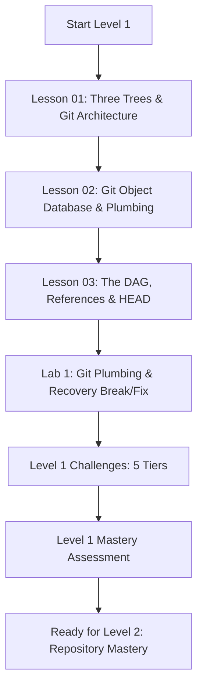

# Level 1 — Git Fundamentals (Plumbing, Porcelain & Objects)

> **Master Git from the inside out: understand the Three-Tree Architecture, content-addressable object database, DAG graph mechanics, and low-level plumbing tools.**

---

## 🎯 Level Objectives

By the end of this level, you will:
1. Master Git's **Three-Tree Architecture**: the Working Directory, the Index (Staging Area), and the Commit Object History (`HEAD`).
2. Understand Git's internal storage engine as a **content-addressable filesystem** storing four immutable object primitives: **Blobs**, **Trees**, **Commits**, and **Annotated Tags**.
3. Use low-level **Plumbing Commands** (`hash-object`, `cat-file`, `write-tree`, `commit-tree`, `update-ref`) to manipulate Git internals directly without porcelain wrappers.
4. Understand Git's **Directed Acyclic Graph (DAG)**, parent-child commit relationships, branch references (`.git/refs/heads/`), and symbolic references (`HEAD`).
5. Intentionally create and recover from **Detached HEAD states** and **Dangling/Orphaned Commits** using `git reflog` and `git fsck`.

---

## 🗺️ Module Curriculum & Roadmap



### Lessons & Materials

| # | Document | Topic & Focus | Depth |
| :---: | :--- | :--- | :---: |
| **01** | [`01-three-trees-and-git-architecture.md`](01-three-trees-and-git-architecture.md) | Working Directory, Index/Staging Area, `HEAD`, Status Lifecycle | Beginner $\to$ Pro |
| **02** | [`02-git-object-database-plumbing.md`](02-git-object-database-plumbing.md) | Blobs, Trees, Commits, Tags, Hashing, Compression, Plumbing Commands | Developer $\to$ Pro |
| **03** | [`03-dag-references-and-head.md`](03-dag-references-and-head.md) | The DAG, Lineage, Refs, Symbolic Refs, Detached HEAD, Reflog | Developer $\to$ Pro |
| **Lab** | [`../labs/01-git-plumbing-and-recovery-lab.md`](../labs/01-git-plumbing-and-recovery-lab.md) | Building Commits via Plumbing, Detached HEAD & Dangling Commit Recovery | Hands-On |
| **Chal** | [`../challenges/01-git-fundamentals-challenges.md`](../challenges/01-git-fundamentals-challenges.md) | 5-Tier Challenge (Manual Tree Graph, Packfiles, Custom Git Hasher) | Tier 1–5 |
| **Quiz** | [`../assessments/01-git-fundamentals-assessment.md`](../assessments/01-git-fundamentals-assessment.md) | Object Model Diagnostics, DAG Traversal & Mastery Rubric | Evaluation |

---

## 🧠 Core Mental Models in this Level

### 1. The Three Trees of Git
Git does not track file diffs; it manages transitions between three distinct data structures:
- **Working Tree**: The physical files on your local filesystem that you edit.
- **Index (Staging Area)**: A binary cache (`.git/index`) representing the exact snapshot destined for the next commit.
- **HEAD (Repository History)**: The commit pointed to by the active branch, representing the durable history recorded in `.git/objects/`.

### 2. The Four Object Primitives
Inside `.git/objects/`, every piece of data is stored under an immutable cryptographic hash:
```
       [ COMMIT OBJECT ]
        ├── tree: [ TREE OBJECT (Root) ]
        │          ├── blob: [ BLOB OBJECT (src/main.py) ]
        │          └── tree: [ TREE OBJECT (docs/) ]
        │                     └── blob: [ BLOB OBJECT (docs/arch.md) ]
        ├── parent: [ PREVIOUS COMMIT SHA ]
        ├── author: "Name <email> timestamp"
        └── message: "feat: initial commit"
```

---

## ✅ Level 1 Mastery Checklist

Before advancing to [Level 2: GitHub Repository Mastery](../02-repositories/), verify you can:
- [ ] Explain how Git stores file contents vs filenames and directory structures.
- [ ] Inspect any object in `.git/objects/` using `git cat-file -t` (type) and `git cat-file -p` (pretty-print).
- [ ] Manually create a blob, index it into a tree, and create a commit using purely plumbing commands.
- [ ] Explain what happens internally when `git checkout <commit-sha>` enters a detached HEAD state.
- [ ] Resurrect a deleted branch or lost commit using `git reflog` without external tools.
- [ ] Score 100% on the [Level 1 Assessment](../assessments/01-git-fundamentals-assessment.md).
