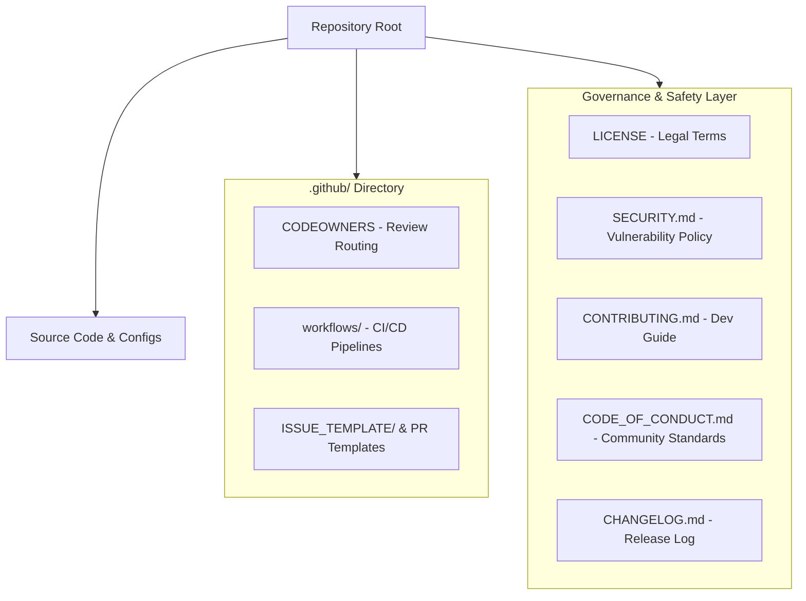
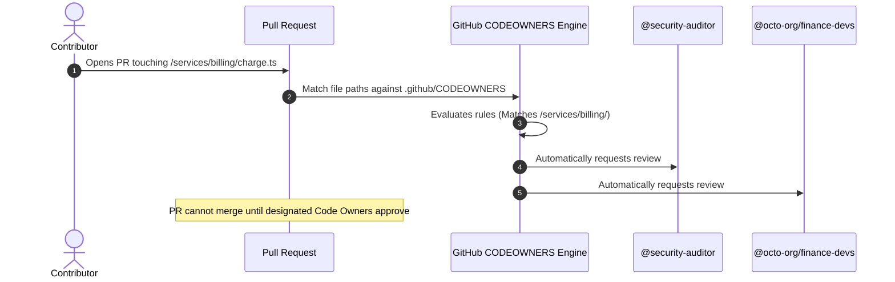

# Lesson 01: Repository Architecture & Governance

---

## 1. Learning Objective
Design, structure, and govern enterprise-grade GitHub repositories by implementing standard community health files (`LICENSE`, `SECURITY.md`, `CONTRIBUTING.md`, `CODE_OF_CONDUCT.md`, `CHANGELOG.md`) and automating code review assignment via **`.github/CODEOWNERS`**.

---

## 2. Why This Matters
Unstructured repositories lead to contributor friction, security vulnerabilities reported publicly without notice, licensing ambiguity, and unreviewed pull requests stalling in code review limbo. A well-architected repository standardizes collaboration, protects intellectual property, and automates team review workflows.

---

## 3. Prerequisites
- Completed [Level 0](../00-foundations/) and [Level 1](../01-git-fundamentals/).
- Basic understanding of GitHub user accounts and organizations.

---

## 4. Concept Explanation

### Anatomy of a Production Repository
A production repository is organized into three distinct tiers:
1. **The Automation & Governance Tier (`.github/`)**: Workflows, issue/PR templates, CODEOWNERS, Dependabot config.
2. **The Community Health Tier (Root Directory)**: `README.md`, `LICENSE`, `SECURITY.md`, `CONTRIBUTING.md`, `CODE_OF_CONDUCT.md`, `CHANGELOG.md`.
3. **The Application / Source Tier (`src/`, `lib/`, `docs/`, `tests/`)**: Project implementation files.

### Standard Community Health Files



1. **`LICENSE`**: Governs legal rights to use, modify, distribute, or privatize the code. Without an explicit license, standard copyright law applies (all rights reserved; nobody may legally copy or fork the code).
   - *MIT*: Permissive, lightweight, standard for open source.
   - *Apache-2.0*: Permissive with explicit patent protection grants.
   - *GPL-3.0*: Strong copyleft (modifications must also be open-sourced under GPL-3.0).
   - *Proprietary*: Closed-source commercial terms.
2. **`SECURITY.md`**: Provides a private disclosure process for security vulnerabilities (e.g. security email or GitHub Private Vulnerability Reporting), preventing zero-day bugs from being exposed in public issues.
3. **`CONTRIBUTING.md`**: Onboarding guide detailing environment setup, test execution, branching standards, and PR requirements.
4. **`CODE_OF_CONDUCT.md`**: Behavioral expectations (typically adopting the *Contributor Covenant*).
5. **`CHANGELOG.md`**: Curated, human-readable list of notable changes per version following *Keep a Changelog* standards.

---

### `.github/CODEOWNERS` Syntax & Mechanics
The `CODEOWNERS` file defines which users or teams automatically become required reviewers when a Pull Request touches specific paths.
- **Location**: `.github/CODEOWNERS` (or root `CODEOWNERS` or `docs/CODEOWNERS`).
- **Rule Precedence**: Rules are evaluated top-to-bottom. **The last matching pattern takes precedence!**

```text
# Syntax: <pattern> <owner1> <owner2>

# Default fallback: entire repo owned by core team
* @octo-org/core-maintainers

# Documentation owned by technical writers
/docs/ @octo-org/tech-writers docs-lead@company.com

# Backend services owned by backend team
/services/api/ @octo-org/backend-team

# Billing and payment logic requires security and finance review
/services/billing/ @octo-org/finance-devs @security-auditor

# Build infrastructure and workflows owned by DevOps
/.github/workflows/ @octo-org/devops-lead
```

---

## 5. Mental Model: Review Routing via CODEOWNERS



---

## 6. Real-World Use Case
In a financial services application, any modification to `/src/compliance/` or `/.github/workflows/` requires mandatory sign-off from the compliance officer and principal architect. By coupling `CODEOWNERS` with a **Branch Ruleset** requiring Code Owner approval, unapproved changes to compliance code are physically blocked from reaching the `main` branch.

---

## 7. Official GitHub Documentation
- [GitHub Docs: About community profiles for public repositories](https://docs.github.com/en/communities/setting-up-your-project-for-healthy-contributions/about-community-profiles-for-public-repositories)
- [GitHub Docs: Adding a security policy to your repository](https://docs.github.com/en/code-security/getting-started/adding-a-security-policy-to-your-repository)
- [GitHub Docs: About code owners](https://docs.github.com/en/repositories/managing-your-repositorys-settings-and-features/customizing-your-repository/about-code-owners)

---

## 8. Recommended High-Quality External Resource
- **Resource**: *ChooseALicense.com* (GitHub Open Source Initiative).
- **Why it helps**: Interactive decision matrix for selecting licenses based on patent grants, commercial use, and copyleft obligations.

---

## 9. Step-by-Step Demonstration

### 1. Initialize Governance Skeleton
```bash
mkdir repo-gov-demo && cd repo-gov-demo
git init
mkdir -p .github/workflows docs services/billing
```

### 2. Author a Standard `SECURITY.md`
```markdown
# Security Policy

## Supported Versions
| Version | Supported          |
| ------- | ------------------ |
| 2.x.x   | :white_check_mark: |
| 1.x.x   | :x:                |

## Reporting a Vulnerability
Please do NOT open public issues for security vulnerabilities.
Email security@example.com with detailed reproduction steps.
```

### 3. Author a Robust `.github/CODEOWNERS`
```text
# Default owner for everything in the repo
* @lead-maintainer

# Documentation
/docs/ @docs-team

# Billing service
/services/billing/ @finance-team @security-lead
```

### 4. Verify Syntax & Commit
```bash
git add .
git commit -m "docs: establish repository governance and CODEOWNERS"
```

---

## 10. Hands-on Lab
Refer to [`../labs/02-repository-hygiene-and-templates-lab.md`](../labs/02-repository-hygiene-and-templates-lab.md).

---

## 11. Challenge
**Challenge**: Construct a `CODEOWNERS` file where `@frontend-team` owns all `.tsx` files everywhere in the repository *except* those inside `/src/admin/`, which must be owned exclusively by `@admin-team`.

---

## 12. Common Mistakes & Gotchas
- **Mistake 1**: Forgetting that `CODEOWNERS` rule precedence is **last-matching**, not first-matching. If you put `* @team` at the bottom, it overrides all specific rules above it!
- **Mistake 2**: Specifying GitHub usernames without the `@` symbol. (e.g. `octocat` instead of `@octocat`).
- **Mistake 3**: Assuming `CODEOWNERS` works on personal fork repositories without branch protection rules enabled.

---

## 13. Professional Practices
- **Use GitHub Teams in CODEOWNERS**: Prefer `@org/team-name` over individual `@usernames`. When team members leave or change roles, repository configuration does not need editing.
- **Enforce Code Owner Reviews in Rulesets**: Always enable "Require review from Code Owners" in Branch Protection or Rulesets.

---

## 14. Security Considerations
- **Private Vulnerability Reporting**: Always enable GitHub's built-in Private Vulnerability Reporting alongside `SECURITY.md` so researchers can report bugs directly through encrypted GitHub advisories.

---

## 15. Interview Questions & Progression

1. **[WHAT]**: What is the purpose of the `.github/CODEOWNERS` file?
   - *Answer*: Automatically assigns designated individuals or teams as required pull request reviewers when modified files match defined path patterns.
2. **[HOW]**: How does GitHub resolve conflicting rules in a `CODEOWNERS` file?
   - *Answer*: It evaluates rules from top to bottom; the last matching pattern in the file takes precedence.
3. **[WHY]**: Why is having an explicit `LICENSE` file critical even for internal private repositories that might later be open-sourced?
   - *Answer*: Code without a license has no legally defined usage rights, creating intellectual property risk and blocking third-party contributions.
4. **[WHAT IF]**: What happens if an owner specified in `CODEOWNERS` does not have write access to the repository?
   - *Answer*: GitHub ignores the invalid owner and will not request a review from that user/team.
5. **[TRADE-OFFS]**: What are the trade-offs between MIT License vs. GPL-3.0 License?
   - *Answer*: MIT maximizes commercial adoption and permissive integration; GPL-3.0 guarantees that all downstream derivatives remain open source (copyleft).

---

## 16. Real-World Scenario
An open-source library receives a pull request that fixes a critical database deadlock in `/db/connection.go`. Because `.github/CODEOWNERS` mapped `/db/` to the `@database-core` team, two database engineers were automatically pinged and reviewed the concurrency lock within 30 minutes, preventing a race condition bug from slipping into the release.

---

## 17. Assessment
Complete the evaluation in [`../assessments/02-repositories-assessment.md`](../assessments/02-repositories-assessment.md).

---

## 18. Mastery Criteria
- [ ] Understands the purpose and location of all community health files.
- [ ] Can write and debug `.github/CODEOWNERS` rules.
- [ ] Understands `CODEOWNERS` precedence mechanics (last match wins).
- [ ] Can select and articulate the trade-offs of major software licenses.

---

## 19. Further Exploration
- Explore GitHub Organization Default Community Health Files (`.github` repository).
- Learn about GitHub Private Vulnerability Reporting and Security Advisories (GHSA).
