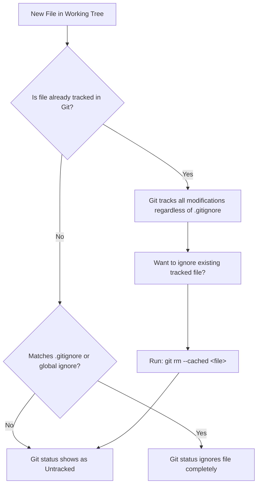

# Lesson 02: `.gitignore` Mechanics & Clean Repository History

---

## 1. Learning Objective
Master `.gitignore` glob pattern matching, precedence hierarchies, diagnostic tools (`git check-ignore -v`), and safely purge accidentally committed build artifacts and sensitive files from history using **`git rm --cached`**.

---

## 2. Why This Matters
Committing temporary build artifacts (`node_modules/`, `target/`, `build/`), OS metadata (`.DS_Store`, `Thumbs.db`), IDE settings, or `.env` files bloats repository clone sizes, creates noisy commit diffs, and causes security leaks. Understanding how Git ignores files ensures repositories remain lean, clean, and secure.

---

## 3. Prerequisites
- Completed [Lesson 01: Repository Architecture & Governance](01-repository-architecture-and-governance.md).
- Understanding of the Index and Working Tree from Level 1.

---

## 4. Concept Explanation

### The Golden Rule of `.gitignore`
> [!IMPORTANT]
> `.gitignore` ONLY prevents **untracked files** from being added to the Index. If a file is *already tracked* in Git history, adding a rule to `.gitignore` does **NOT** stop Git from tracking changes to it!

### Glob Pattern Syntax Specification

| Pattern | Meaning | Example Match | Non-Match |
| :--- | :--- | :--- | :--- |
| `logs/` | Matches directory named `logs` at any level | `logs/app.log`, `src/logs/debug.log` | `logs.txt` |
| `/logs/` | Anchored to repo root only | `/logs/app.log` | `/src/logs/app.log` |
| `*.log` | Matches all files ending in `.log` | `debug.log`, `src/error.log` | `log.txt` |
| `temp?.txt`| Single wildcard character | `temp1.txt`, `tempa.txt` | `temp10.txt` |
| `**` | Leading/trailing directory wildcard | `**/build/output.bin` | Direct child only |
| `!important.log` | Negation / Re-inclusion | Re-includes file even if `*.log` ignored | - |

### Negation Caveat
You **cannot** re-include a file if a parent directory of that file is already ignored:
```text
# This will NOT work:
/dist/
!/dist/bundle.js  # Git won't re-include this because /dist/ was skipped!

# Correct way:
/dist/*
!/dist/bundle.js  # Works!
```

---

## 5. Mental Model & Diagnostic Flow



---

## 6. Real-World Use Case
A team lead clones a repository and notices `npm install` takes 5 minutes to clone because an earlier developer committed a 200MB `node_modules/` folder. Using `git rm -r --cached node_modules/` and updating `.gitignore`, the team purges the folder from active tracking while keeping local developer modules untouched on disk.

---

## 7. Official GitHub Documentation
- [Pro Git Book: Ignoring Files](https://git-scm.com/book/en/v2/Git-Basics-Recording-Changes-to-the-Repository#_ignoring)
- [GitHub Docs: Ignoring files](https://docs.github.com/en/get-started/getting-started-with-git/ignoring-files)
- [GitHub Recommended .gitignore Templates](https://github.com/github/gitignore)

---

## 8. Recommended High-Quality External Resource
- **Resource**: *gitignore.io* (Toptal).
- **Why it helps**: Generates battle-tested combined `.gitignore` files for operating systems, languages, and IDEs.

---

## 9. Step-by-Step Demonstration

### 1. Initialize Sandbox
```bash
mkdir gitignore-demo && cd gitignore-demo
git init
```

### 2. Configure Global Ignore for OS & IDE Debris
```bash
# Create global ignore file
cat << 'EOF' > ~/.gitignore_global
.DS_Store
Thumbs.db
*.swp
.vscode/
.idea/
EOF

# Register globally with Git
git config --global core.excludesfile ~/.gitignore_global
```

### 3. Author Project `.gitignore`
```bash
cat << 'EOF' > .gitignore
# Build outputs
/dist/
/build/
*.pyc
__pycache__/

# Logs
*.log
!important_audit.log

# Environment credentials
.env
.env.*
!.env.example
EOF
```

### 4. Test Ignore Patterns with `git check-ignore -v`
```bash
# Create dummy files
mkdir dist
touch dist/app.js debug.log important_audit.log .env .env.example

# Debug why a file is ignored
git check-ignore -v debug.log
# Output: .gitignore:9:*.log debug.log

git check-ignore -v .env
# Output: .gitignore:13:.env .env

git status --short
# Notice: only .env.example and important_audit.log appear as untracked!
```

### 5. Untrack a Previously Committed File Without Deleting from Disk
```bash
# Simulate accidental commit of a tracked log file
touch server.log
git add -f server.log
git commit -m "chore: accidentally committed log"

# Now add server.log to .gitignore
echo "server.log" >> .gitignore

# Observe: git status still tracks server.log if you edit it!
echo "new log line" >> server.log
git status
# Shows 'modified: server.log'

# The Fix: Remove from Index, keep on disk
git rm --cached server.log
git commit -m "chore: stop tracking server.log"

# Verify: server.log still exists on disk, but Git ignores it!
ls -la server.log
git status
```

---

## 10. Hands-on Lab
Refer to [`../labs/02-repository-hygiene-and-templates-lab.md`](../labs/02-repository-hygiene-and-templates-lab.md).

---

## 11. Challenge
**Challenge**: Given a directory structure where you want to ignore all `.json` files in the repository *except* those located inside `/locales/` or `/config/schema/`, write the minimal, correct `.gitignore` pattern.

---

## 12. Common Mistakes & Gotchas
- **Mistake 1**: Adding a rule to `.gitignore` and wondering why Git still tracks changes to the file. (*Cause: The file was already tracked in history; run `git rm --cached`*).
- **Mistake 2**: Putting trailing spaces at the end of `.gitignore` lines. (*Gotcha: Spaces become part of the pattern, causing ignore failures*).
- **Mistake 3**: Trying to re-include a file (`!dir/file.txt`) when the parent directory (`dir/`) is ignored.

---

## 13. Professional Practices
- **Never Commit Real `.env` Files**: Always commit a sanitized `.env.example` file and ignore `.env*`.
- **Use `core.excludesfile` for Machine-Specific Files**: Keep personal IDE configs (`.idea`, `.vscode`) in `~/.gitignore_global` rather than polluting team `.gitignore` files.

---

## 14. Security Considerations
- **`git rm --cached` Does NOT Delete Historical Secrets**: If an API key was committed 3 commits ago, `git rm --cached` removes it from future commits, but the key remains in Git history. You must rotate the key immediately and run BFG Repo-Cleaner or `git filter-repo`.

---

## 15. Interview Questions & Progression

1. **[WHAT]**: What is the purpose of `git check-ignore -v`?
   - *Answer*: Diagnoses why a file is being ignored by showing the exact `.gitignore` file and line number matching the pattern.
2. **[HOW]**: How do you stop tracking a file without deleting it from your local disk?
   - *Answer*: Execute `git rm --cached <file-path>`.
3. **[WHY]**: Why does adding a file to `.gitignore` fail to un-track it if it was previously committed?
   - *Answer*: Because `.gitignore` only instructs Git not to stage untracked files; tracked files already have a registered blob entry in the Index.
4. **[WHAT IF]**: What happens if you run `git add -f <ignored-file>`?
   - *Answer*: Git forces the ignored file into the Index, bypassing all `.gitignore` rules.
5. **[TRADE-OFFS]**: What are the trade-offs of storing `.vscode/` settings in project `.gitignore` vs `~/.gitignore_global`?
   - *Answer*: Global ignore keeps team repos editor-agnostic; project-level tracking allows sharing recommended project extensions and debug profiles.

---

## 16. Real-World Scenario
A developer accidentally stages `.env.production` containing database credentials and pushes to a private repository. The maintainer detects the secret, immediately revokes the database password, uses `git rm --cached .env.production` to stop tracking, adds `.env*` and `!.env.example` to `.gitignore`, and triggers key rotation across the infrastructure.

---

## 17. Assessment
Complete the evaluation in [`../assessments/02-repositories-assessment.md`](../assessments/02-repositories-assessment.md).

---

## 18. Mastery Criteria
- [ ] Understands glob syntax, leading/trailing slash distinctions, and negation rules.
- [ ] Fluently debugs ignore rules using `git check-ignore -v`.
- [ ] Can safely untrack committed files via `git rm --cached` without data loss.
- [ ] Configures global ignore with `core.excludesfile`.

---

## 19. Further Exploration
- Explore repository-specific local exclude rules in `.git/info/exclude`.
- Learn `git clean -ndX` for previewing and cleaning ignored debris.
