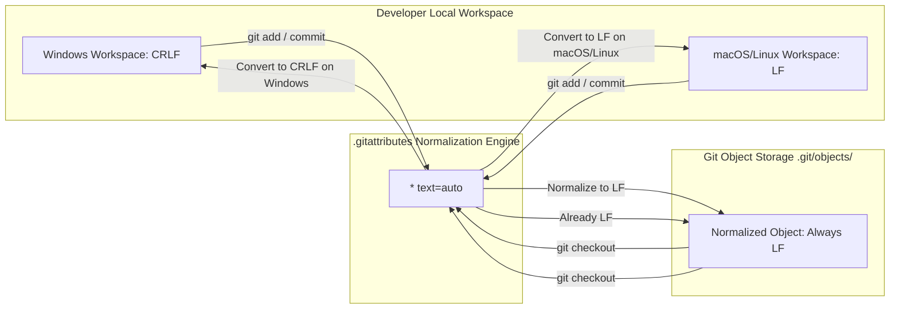

# Lesson 03: `.gitattributes` & Cross-Platform Line Endings

---

## 1. Learning Objective
Eliminate cross-platform line ending corruption (`CRLF` $\leftrightarrow$ `LF`), configure binary file safety, customize diff behavior, and override language statistics using **`.gitattributes`** and **`git add --renormalize`**.

---

## 2. Why This Matters
When developers on Windows collaborate with developers on macOS/Linux, mismatched line endings cause entire files (thousands of lines) to appear modified in pull requests, obscuring real changes. Worse, committing Windows `CRLF` endings into shell scripts causes Linux servers and Docker containers to fail with `\r: command not found` or `/bin/bash^M: bad interpreter`.

---

## 3. Prerequisites
- Completed [Lesson 02: `.gitignore` Mechanics](02-gitignore-and-clean-history.md).
- Understanding of Git Trees and Commits.

---

## 4. Concept Explanation

### The Root Cause: CRLF vs. LF
- **Windows**: Uses Carriage Return + Line Feed (`\r\n` or `CRLF`, 2 bytes per newline).
- **macOS / Linux**: Uses Line Feed (`\n` or `LF`, 1 byte per newline).

### Why `.gitattributes` Over `core.autocrlf`
While `core.autocrlf` is set on individual developer workstations, individual settings are brittle and easily misconfigured. A **`.gitattributes`** file committed to the repository root enforces uniform line ending rules for **every developer and CI runner** automatically!

### Core `.gitattributes` Directives



1. **`* text=auto`**: Git auto-detects text files, converts `CRLF` to `LF` when committing to the object database, and converts `LF` to OS-native endings when checking out to disk.
2. **`*.sh text eol=lf`**: Forces LF line endings on disk regardless of OS (essential for shell scripts and Docker entrypoints).
3. **`*.bat text eol=crlf`**: Forces CRLF line endings on disk.
4. **`*.png binary`** (or `-text -diff`): Prevents Git from ever attempting newline normalization or corrupting binary payloads.

### GitHub Linguist & PR Review Overrides
`.gitattributes` controls how GitHub displays files in Pull Requests and computes language stats:
- **`*.min.js linguist-generated=true`**: Automatically collapses minified/generated files in PR reviews.
- **`vendor/* linguist-vendored`**: Excludes third-party libraries from repository language percentages.
- **`docs/* linguist-documentation`**: Excludes documentation from language calculation bars.

---

## 5. Mental Model: The Production `.gitattributes` Blueprint

```text
# 1. Global text normalization
* text=auto

# 2. Strict Unix/Linux line endings (Shell scripts, configs, Docker)
*.sh text eol=lf
*.bash text eol=lf
Dockerfile text eol=lf
.env.example text eol=lf

# 3. Strict Windows line endings
*.bat text eol=crlf
*.cmd text eol=crlf
*.ps1 text eol=crlf

# 4. Strict Binary formats
*.png binary
*.jpg binary
*.pdf binary
*.zip binary
*.tar.gz binary
*.ico binary

# 5. GitHub Linguist overrides
/docs/** linguist-documentation
/vendor/** linguist-vendored
*.generated.ts linguist-generated=true
```

---

## 6. Real-World Use Case
A team deploys a Node.js microservice inside an Alpine Linux Docker container. A Windows developer edits `entrypoint.sh` and pushes. The container crashes in production with:
`/bin/sh: ./entrypoint.sh^M: not found`
Adding `*.sh text eol=lf` to `.gitattributes` and renormalizing fixes the issue permanently for all team members.

---

## 7. Official GitHub Documentation
- [Pro Git Book: Customizing Git - Git Attributes](https://git-scm.com/book/en/v2/Customizing-Git-Git-Attributes)
- [GitHub Docs: Configuring line endings](https://docs.github.com/en/get-started/getting-started-with-git/configuring-git-to-handle-line-endings)
- [GitHub Linguist Overrides Documentation](https://github.com/github-linguist/linguist/blob/master/docs/overrides.md)

---

## 8. Recommended High-Quality External Resource
- **Resource**: *Mind the End of Your Line* (GitHub Engineering Blog).
- **Why it helps**: Technical breakdown of why line ending normalization prevents corrupted git patches and merge conflicts.

---

## 9. Step-by-Step Demonstration

### 1. Initialize Sandbox with Mixed Line Endings
```bash
mkdir gitattributes-demo && cd gitattributes-demo
git init
```

### 2. Simulate Corrupted CRLF File on Linux/macOS
```bash
# Write file with explicit Windows CRLF carriage returns (\r\n)
printf "line1\r\nline2\r\nline3\r\n" > script.sh

# Observe carriage return in file
file script.sh
# Output: script.sh: ASCII text, with CRLF line terminators
```

### 3. Create `.gitattributes`
```bash
cat << 'EOF' > .gitattributes
* text=auto
*.sh text eol=lf
*.bat text eol=crlf
*.png binary
EOF
```

### 4. Renormalize Repository Line Endings
```bash
# Renormalize entire repository against the new .gitattributes rules
git add --renormalize .

# View diff to see line ending normalization
git diff --staged
# Notice: CRLF has been stripped and normalized to LF in the index!

git commit -m "chore: establish .gitattributes and renormalize line endings"
```

---

## 10. Hands-on Lab
Refer to [`../labs/02-repository-hygiene-and-templates-lab.md`](../labs/02-repository-hygiene-and-templates-lab.md).

---

## 11. Challenge
**Challenge**: Configure `.gitattributes` so that all files ending in `.schema.json` are treated as text, auto-collapsed in GitHub PR reviews, and excluded from repository language detection bars.

---

## 12. Common Mistakes & Gotchas
- **Mistake 1**: Adding `.gitattributes` but forgetting to run `git add --renormalize .`. (*Result: Existing files in Git history remain in their corrupted CRLF state until touched.*)
- **Mistake 2**: Marking binary files as `text`. (*Danger: Git will attempt to replace byte sequences matching `0x0D 0x0A` (`\r\n`) with `0x0A`, corrupting images and compiled binaries!*)
- **Mistake 3**: Ignoring shell scripts on Windows (`*.sh`), causing Docker build failures.

---

## 13. Professional Practices
- **Commit `.gitattributes` as the Very First Commit**: Add `.gitattributes` when initializing a new repository before any source code is added.
- **Always Include `* text=auto`**: This is the universal baseline recommended by GitHub and the Git core team.

---

## 14. Security Considerations
- **Binary File Corruption**: Corrupting cryptographic key files, certificates, or signed binary blobs through unintended line-ending transformation invalidates signatures and breaks authentication. Always mark `.key`, `.pem`, and `.cer` files appropriately.

---

## 15. Interview Questions & Progression

1. **[WHAT]**: What does `* text=auto` in `.gitattributes` do?
   - *Answer*: Enables Git's automatic text file detection, ensuring files are normalized to LF in `.git/objects/` while checked out in the host OS's native format.
2. **[HOW]**: How do you fix a repository where 500 files show phantom diffs due to line endings?
   - *Answer*: Add `* text=auto` to `.gitattributes` and execute `git add --renormalize .` followed by a commit.
3. **[WHY]**: Why is setting `*.sh text eol=lf` critical in cross-platform teams?
   - *Answer*: Windows checkouts would otherwise write `\r\n` line endings to `.sh` scripts, which Linux interpreters reject with syntax errors when mounted into Docker or executed on Linux servers.
4. **[WHAT IF]**: What happens if a binary PNG file is accidentally treated as `text` by Git?
   - *Answer*: Git may replace `\r\n` byte sequences with `\n`, corrupting the image file format.
5. **[TRADE-OFFS]**: What are the trade-offs of using `.gitattributes` vs configuring `core.autocrlf` locally?
   - *Answer*: `.gitattributes` is versioned and enforced universally across all contributors and CI runners; `core.autocrlf` depends on every individual engineer configuring their machine correctly.

---

## 16. Real-World Scenario
A multinational team building a FinTech API experienced daily merge conflicts in `package-lock.json` because Windows developers committed `CRLF` and macOS developers committed `LF`. By adding `package-lock.json text eol=lf` and running `git add --renormalize .`, the team eliminated 100% of line-ending merge conflicts overnight.

---

## 17. Assessment
Complete the evaluation in [`../assessments/02-repositories-assessment.md`](../assessments/02-repositories-assessment.md).

---

## 18. Mastery Criteria
- [ ] Understands CRLF vs LF mechanics and Linux interpreter failures (`^M`).
- [ ] Authors production-grade `.gitattributes` files with text, eol, and binary directives.
- [ ] Confidently renormalizes repository history using `git add --renormalize .`.
- [ ] Configures GitHub Linguist overrides for generated and vendored files.

---

## 19. Further Exploration
- Explore Git custom diff drivers (e.g. `diff=exif` for JPEG metadata, `diff=jupyternotebook`).
- Learn how Git Large File Storage (Git LFS) hooks into `.gitattributes` via `filter=lfs`.
