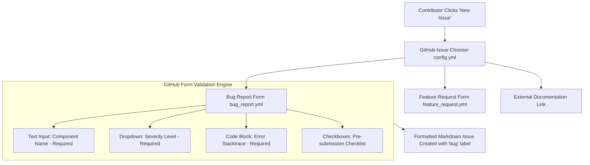

# Lesson 04: GitHub Issue Forms & Pull Request Templates

---

## 1. Learning Objective
Engineer production-grade **GitHub Issue Forms** using modern YAML schemas (`.github/ISSUE_TEMPLATE/*.yml`), enforce standardized **Pull Request Templates** (`.github/PULL_REQUEST_TEMPLATE.md`), and configure **Template Repositories** for enterprise team boilerplates.

---

## 2. Why This Matters
Unstructured issue trackers fill up with vague reports ("Login is broken, please fix") lacking OS details, logs, or reproduction steps. Incomplete PRs merge untested changes and introduce regressions. Structured forms turn issue reporting and code review into high-efficiency, standardized workflows with mandatory checklists.

---

## 3. Prerequisites
- Completed [Lesson 01: Repository Architecture & Governance](01-repository-architecture-and-governance.md).
- Familiarity with YAML syntax (indentation, keys, lists).

---

## 4. Concept Explanation

### Markdown Templates vs. Modern YAML Issue Forms
Traditionally, GitHub used Markdown files for issue templates. Today, GitHub provides **Issue Forms** written in YAML:
- **Markdown Templates (`.md`)**: Free-form text. Users can easily delete prompts, bypass checklists, and submit blank issues.
- **YAML Issue Forms (`.yml`)**: Interactive web forms rendered in the GitHub UI with validated required inputs, dropdown menus, multi-select checkboxes, code snippet blocks, and automated label assignment.

### Location Hierarchy for Templates
GitHub automatically discovers templates in these locations:
- Issue Forms: `.github/ISSUE_TEMPLATE/*.yml`
- Issue Template Chooser Config: `.github/ISSUE_TEMPLATE/config.yml`
- Default Pull Request Template: `.github/PULL_REQUEST_TEMPLATE.md` (or `.github/pull_request_template.md`)
- Custom PR Templates: `.github/PULL_REQUEST_TEMPLATE/feature.md`, `.github/PULL_REQUEST_TEMPLATE/hotfix.md`

---

## 5. Mental Model & Form Architecture



---

## 6. Real-World Use Case
An open-source library receives 50 bug reports a week. By migrating from a markdown template to a YAML Issue Form with mandatory fields for `Node.js Version`, `Operating System`, and `Minimal Reproduction Repository URL`, the triage time per issue drops from 15 minutes of back-and-forth questioning to under 2 minutes.

---

## 7. Official GitHub Documentation
- [GitHub Docs: Syntax for GitHub's form schema](https://docs.github.com/en/communities/using-templates-to-encourage-useful-issues-and-pull-requests/syntax-for-githubs-form-schema)
- [GitHub Docs: Configuring issue templates for your repository](https://docs.github.com/en/communities/using-templates-to-encourage-useful-issues-and-pull-requests/configuring-issue-templates-for-your-repository)
- [GitHub Docs: Creating a pull request template](https://docs.github.com/en/communities/using-templates-to-encourage-useful-issues-and-pull-requests/creating-a-pull-request-template-for-your-repository)

---

## 8. Recommended High-Quality External Resource
- **Resource**: *GitHub Issue Forms Playground & Schema Validator* (GitHub Docs).
- **Why it helps**: Interactive schema validation for debugging YAML form syntax before committing to `.github/`.

---

## 9. Step-by-Step Demonstration

### 1. Create Issue Template Directory Structure
```bash
mkdir -p .github/ISSUE_TEMPLATE
```

### 2. Configure Issue Chooser (`.github/ISSUE_TEMPLATE/config.yml`)
```yaml
blank_issues_enabled: false
contact_links:
  - name: Community Discussions & Questions
    url: https://github.com/octo-org/project/discussions
    about: Please ask general support and setup questions in GitHub Discussions!
  - name: Security Vulnerability Reporting
    url: https://github.com/octo-org/project/security/advisories/new
    about: Report critical security vulnerabilities privately.
```

### 3. Author a Production YAML Bug Report (`.github/ISSUE_TEMPLATE/bug_report.yml`)
```yaml
name: 🐛 Bug Report
description: File a reproducible bug report to help us improve.
title: "[BUG]: "
labels: ["bug", "triage-needed"]
body:
  - type: markdown
    attributes:
      value: |
        Thanks for taking the time to report this issue! Please provide detailed reproduction steps.

  - type: input
    id: component
    attributes:
      label: Affected Subsystem / Component
      placeholder: e.g. Auth Service, Payment Gateway, CLI
    validations:
      required: true

  - type: dropdown
    id: severity
    attributes:
      label: Severity / Impact
      options:
        - Low (Minor UI glitch / cosmetic)
        - Medium (Non-blocking bug with workaround)
        - High (Core feature broken)
        - Critical (System crash / data loss / production blocker)
    validations:
      required: true

  - type: textarea
    id: reproduction
    attributes:
      label: Steps to Reproduce
      description: Provide step-by-step instructions to reproduce the behavior.
      placeholder: |
        1. Navigate to '/checkout'
        2. Click on 'Submit Order'
        3. Observe 500 internal server error
    validations:
      required: true

  - type: textarea
    id: logs
    attributes:
      label: Terminal / Browser Logs
      description: Paste relevant logs or stacktraces.
      render: shell

  - type: checkboxes
    id: checklist
    attributes:
      label: Pre-Submission Checklist
      options:
        - label: I have searched existing issues and verified this is not a duplicate.
          required: true
        - label: I have tested with the latest release version.
          required: true
```

### 4. Author a Production Pull Request Template (`.github/PULL_REQUEST_TEMPLATE.md`)
```markdown
## 📋 Description
<!-- Provide a concise summary of the changes in this PR and why they are needed. -->

Closes #<!-- Issue Number -->

## 🛠️ Type of Change
- [ ] 🐛 Bug fix (non-breaking change which fixes an issue)
- [ ] ✨ New feature (non-breaking change which adds functionality)
- [ ] 💥 Breaking change (fix or feature that would cause existing functionality to not work as expected)
- [ ] 📚 Documentation update
- [ ] 🔧 Refactoring / Chore

## 🧪 Testing Performed
<!-- Describe the automated or manual tests you executed to verify your changes. -->
- [ ] Unit tests added / updated (`npm test` / `pytest`)
- [ ] Verified manually on local environment

## 🔒 Security & Quality Checklist
- [ ] Code follows project conventions in `docs/conventions.md`
- [ ] No hardcoded secrets, private keys, or API tokens
- [ ] Commits are cryptographically signed (`-S`)
- [ ] Self-reviewed the diff before opening PR
```

---

## 10. Hands-on Lab
Refer to [`../labs/02-repository-hygiene-and-templates-lab.md`](../labs/02-repository-hygiene-and-templates-lab.md).

---

## 11. Challenge
**Challenge**: Create a custom Pull Request template specifically for Hotfixes (`.github/PULL_REQUEST_TEMPLATE/hotfix.md`) that requires linking an incident ticket number, documenting the rollback plan, and requiring approval from on-call personnel.

---

## 12. Common Mistakes & Gotchas
- **Mistake 1**: Invalid YAML indentation in issue forms. (*Result: GitHub fails to render the form and displays a raw error banner.*)
- **Mistake 2**: Leaving `blank_issues_enabled: true` in `config.yml`. (*Result: Users bypass structured forms and submit unformatted one-sentence issues.*)
- **Mistake 3**: Placing PR templates inside `.github/ISSUE_TEMPLATE/`. (*Result: PR templates must be in `.github/` or `.github/PULL_REQUEST_TEMPLATE/`*).

---

## 13. Professional Practices
- **Auto-Label Issues**: Assign default labels (`bug`, `feature`, `documentation`) directly within YAML forms so triage workflows can filter them immediately.
- **Link Issues to PRs Automatically**: Require the `Closes #123` or `Fixes #123` keyword in PR templates to trigger automated issue closing upon merge.

---

## 14. Security Considerations
- **Redirecting Security Reports**: In `config.yml`, always route security vulnerability disclosures to private reporting channels (`/security/advisories/new`) to prevent zero-day exposure.

---

## 15. Interview Questions & Progression

1. **[WHAT]**: What is the difference between GitHub Issue Forms (YAML) and traditional Markdown issue templates?
   - *Answer*: YAML Issue Forms render interactive web UI forms with client-side field validation, required dropdowns, and automated labeling; Markdown templates are static text files that users can delete or bypass.
2. **[HOW]**: How do you disable blank, unformatted issue submissions in a repository?
   - *Answer*: Add `blank_issues_enabled: false` inside `.github/ISSUE_TEMPLATE/config.yml`.
3. **[WHY]**: Why is including `Closes #<issue-id>` in Pull Request templates a best practice?
   - *Answer*: It links the PR directly to the issue graph and automatically closes the issue when the PR is merged into the default branch.
4. **[WHAT IF]**: What happens if a user submits an Issue Form without filling in a field with `required: true`?
   - *Answer*: The GitHub web interface blocks form submission and highlights the missing field.
5. **[TRADE-OFFS]**: What are the trade-offs of Template Repositories vs. Git Forking for creating new microservice repositories?
   - *Answer*: Template repositories start with clean, single-commit histories and decoupled branch settings; forks retain upstream commit history and PR relationships.

---

## 16. Real-World Scenario
An engineering organization maintaining 40 microservices created a standardized **Template Repository** (`octo-starter-microservice`) containing pre-configured GitHub Actions, `.gitignore`, `.gitattributes`, `CODEOWNERS`, Issue Forms, and PR templates. When launching a new microservice, engineers click "Use this template", ensuring 100% compliance with organizational security and quality standards from Day 1.

---

## 17. Assessment
Complete the evaluation in [`../assessments/02-repositories-assessment.md`](../assessments/02-repositories-assessment.md).

---

## 18. Mastery Criteria
- [ ] Authors valid GitHub Issue Forms using YAML schemas with multiple field types.
- [ ] Disables blank issues and routes external links in `config.yml`.
- [ ] Designs comprehensive Pull Request templates with linking keywords and checklists.
- [ ] Understands Template Repositories for team scaffolding.

---

## 19. Further Exploration
- Explore GitHub Organization-level default issue and PR templates in the `.github` repository.
- Learn about template repository configuration (`is_template: true`).
