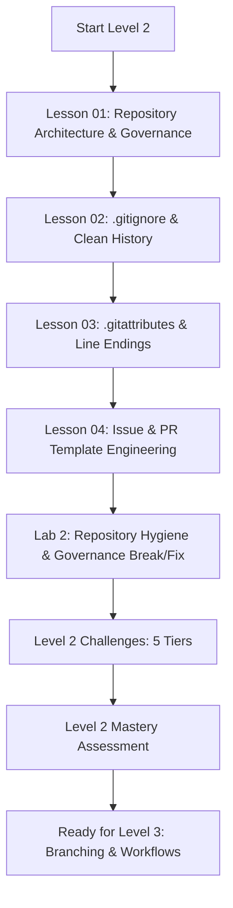

# Level 2 — GitHub Repository Mastery & Hygiene

> **Architect production-grade repositories: master repository hygiene, ignore rules, line ending normalization, community standards, and automated ownership governance.**

---

## 🎯 Level Objectives

By the end of this level, you will:
1. Design professional repository structures with standard community health files (`LICENSE`, `SECURITY.md`, `CODE_OF_CONDUCT.md`, `SUPPORT.md`, `CHANGELOG.md`).
2. Configure granular, leak-proof **`.gitignore`** rules, diagnose ignore conflicts with `git check-ignore -v`, and purge previously committed artifacts from history cleanly with `git rm --cached`.
3. Eliminate cross-platform line ending corruption (`CRLF` $\leftrightarrow$ `LF`) and configure binary filters, diff drivers, and language overrides using **`.gitattributes`**.
4. Enforce automated code review assignments and access boundaries using GitHub's **`CODEOWNERS`** engine.
5. Engineer structured **GitHub Issue Forms** (YAML schema specification) and standardized **Pull Request Templates** (`.github/PULL_REQUEST_TEMPLATE.md`).

---

## 🗺️ Module Curriculum & Roadmap



### Lessons & Materials

| # | Document | Topic & Focus | Depth |
| :---: | :--- | :--- | :---: |
| **01** | [`01-repository-architecture-and-governance.md`](01-repository-architecture-and-governance.md) | Standard Anatomy, Community Health Files, Licenses, CODEOWNERS | Beginner $\to$ Pro |
| **02** | [`02-gitignore-and-clean-history.md`](02-gitignore-and-clean-history.md) | Glob Syntax, Precedence, Untracking Files (`git rm --cached`), `check-ignore` | Developer $\to$ Pro |
| **03** | [`03-gitattributes-and-line-endings.md`](03-gitattributes-and-line-endings.md) | Line Ending Normalization (`text=auto`), Binary Diffs, Linguist Overrides | Developer $\to$ Pro |
| **04** | [`04-issue-and-pr-templates.md`](04-issue-and-pr-templates.md) | Issue Forms YAML Schemas, PR Checklists, Template Repositories | Developer $\to$ Pro |
| **Lab** | [`../labs/02-repository-hygiene-and-templates-lab.md`](../labs/02-repository-hygiene-and-templates-lab.md) | Purging Committed Secrets, Fixing CRLF Monorepo Corruption, CODEOWNERS Fix | Hands-On |
| **Chal** | [`../challenges/02-repositories-challenges.md`](../challenges/02-repositories-challenges.md) | 5-Tier Challenges (Ignore Matrix, Multi-Team CODEOWNERS, Repo Linter) | Tier 1–5 |
| **Quiz** | [`../assessments/02-repositories-assessment.md`](../assessments/02-repositories-assessment.md) | Diagnostic Assessment, Scenario Calculations & Mastery Rubric | Evaluation |

---

## 🧠 Core Mental Models in this Level

### 1. The Living Repository Standard
A professional GitHub repository is more than a folder of code. It contains a self-documenting governance and automation layer located in the root and `.github/` directories:
```
my-production-repo/
├── .github/
│   ├── CODEOWNERS                  # Automated review assignments
│   ├── PULL_REQUEST_TEMPLATE.md    # PR checklist & guidelines
│   └── ISSUE_TEMPLATE/
│       ├── bug_report.yml          # Structured YAML issue form
│       ├── feature_request.yml     # Feature proposal form
│       └── config.yml              # Issue template chooser config
├── .gitignore                      # Ignore patterns for artifacts/secrets
├── .gitattributes                 # Line endings, binary diffs, linguist rules
├── LICENSE                         # Open-source or proprietary terms
├── SECURITY.md                     # Vulnerability disclosure policy
├── CONTRIBUTING.md                 # Contributor guide & developer setup
└── README.md                       # Product overview, setup, architecture
```

### 2. The `.gitignore` vs. Tracked State Boundary
`.gitignore` only prevents **untracked files** from being added to the Index. Once a file has been committed into Git history, adding it to `.gitignore` does **NOT** stop Git from tracking modifications. It must be explicitly removed from the Index with `git rm --cached`.

---

## ✅ Level 2 Mastery Checklist

Before advancing to [Level 3: Branching & Professional Git Workflows](../03-branching-workflows/), verify you can:
- [ ] Select and configure appropriate open-source (MIT, Apache-2.0, GPL-3.0) or commercial proprietary licenses.
- [ ] Write complex `.gitignore` glob patterns and debug matching with `git check-ignore -v <path>`.
- [ ] Safely untrack erroneously committed build artifacts or logs without deleting local files on disk.
- [ ] Author a robust `.gitattributes` file and renormalize repository line endings cleanly with zero phantom diffs.
- [ ] Define multi-team ownership rules in `.github/CODEOWNERS` with wildcard path matching.
- [ ] Author valid GitHub Issue Forms using YAML schemas.
- [ ] Score 100% on the [Level 2 Assessment](../assessments/02-repositories-assessment.md).
