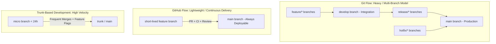

# Lesson 01: Branching Strategies — GitHub Flow vs. Trunk-Based Development

---

## 1. Learning Objective
Compare, evaluate, and implement professional branching models: **Trunk-Based Development (TBD)**, **GitHub Flow**, **Git Flow**, and **Release Branching**. Understand how short-lived branches, Feature Flags, and automated CI enable rapid continuous delivery.

---

## 2. Why This Matters
Choosing the wrong branching strategy is the #1 cause of "Merge Hell," delayed release cycles, broken deployments, and stalled developer velocity. Understanding modern trunk-based and GitHub Flow methodologies allows teams to ship code safely multiple times a day instead of enduring high-stress monthly release panics.

---

## 3. Prerequisites
- Completed [Level 0](../00-foundations/), [Level 1](../01-git-fundamentals/), and [Level 2](../02-repositories/).
- Understanding of the DAG, commits, and branch pointers.

---

## 4. Concept Explanation

### The Evolution of Branching Models



### 1. Trunk-Based Development (TBD)
- **Core Principle**: All developers merge short-lived branches (lifespan $< 24\text{ hours}$) or commit directly to a single shared branch (`main` / `trunk`).
- **Feature Flags**: Large unfinished features are merged into `main` behind Boolean feature toggles, decoupling code deployment from feature release.
- **Benefits**: Eliminates merge conflicts, prevents code staleness, accelerates CI feedback loops. Standard in high-performing engineering teams (Google, Meta, Netflix).

### 2. GitHub Flow
- **Core Principle**: Create a branch off `main`, commit changes, open a Pull Request, discuss/review with team, deploy from PR for verification, merge into `main`.
- **Ideal For**: Web applications, SaaS services, continuous delivery pipelines.

### 3. Git Flow (Legacy)
- **Core Principle**: Complex dual-branch model with long-lived `main` (production) and `develop` (staging) branches, plus formal `feature/`, `release/`, and `hotfix/` branches.
- **Downsides**: High merge conflict overhead, complex backporting, contradicts continuous integration principles.

### 4. Release / Maintenance Branching
- **Core Principle**: Dedicated release branches (`release/v2.1`, `release/v2.2`) for versioned software libraries, mobile apps, or enterprise on-premise software requiring LTS security backports.

---

## 5. Mental Model: Branching Strategy Decision Matrix

| Dimension | Trunk-Based Development | GitHub Flow | Git Flow | Release Branching |
| :--- | :--- | :--- | :--- | :--- |
| **Branch Lifespan** | Hours ($< 1-2$ days) | 1–3 days | Weeks / Months | Long-lived per release |
| **Deployment Cadence** | Multiple times per day | Daily / On Merge | Scheduled (Monthly/Quarterly) | SemVer Releases |
| **Conflict Risk** | Minimal | Low | High ("Merge Hell") | Moderate |
| **Release Mechanism** | Feature Flags / Toggles | Direct PR merge to `main` | Tagging `main` via `release/` | Maintenance tags (`v1.4.2`) |
| **Best Fit For** | High-velocity microservices | Web Apps & SaaS | Legacy embedded systems | Public SDKs & Libraries |

---

## 6. Real-World Use Case
A financial technology company deploys to production 20 times a day using **Trunk-Based Development**. A team building a new credit card rewards engine works in 1-day micro-branches, merging directly to `main`. Because the feature is wrapped in `if (FeatureFlags.isEnabled("NEW_REWARDS"))`, the code safely runs in production dormant until product managers flip the switch.

---

## 7. Official GitHub Documentation
- [GitHub Docs: GitHub flow](https://docs.github.com/en/get-started/using-github/github-flow)
- [GitHub Blog: Introduction to GitHub flow](https://github.blog/news-insights/product-news/github-flow/)
- [Trunk-Based Development Portal](https://trunkbaseddevelopment.com/)

---

## 8. Recommended High-Quality External Resource
- **Resource**: *Why Git Flow is Hurting Your Team* by Dave Farley (Continuous Delivery).
- **Why it helps**: In-depth architectural breakdown of why long-lived branches prevent true Continuous Integration.

---

## 9. Step-by-Step Demonstration

### 1. Trunk-Based Short-Lived Feature Branch Workflow
```bash
# 1. Ensure local main is synchronized with remote
git checkout main
git pull --ff-only origin main

# 2. Spawn a short-lived micro branch
git checkout -b feat/add-payment-validation

# 3. Make small atomic commits
echo "export function validatePayment() { return true; }" > validate.ts
git add validate.ts
git commit -m "feat(payment): add initial validation helper"

# 4. Push to remote and open Pull Request immediately
git push -u origin feat/add-payment-validation
```

### 2. Implementing a Feature Toggle in Code
```typescript
// featureFlags.ts
export const FLAGS = {
  ENABLE_NEW_CHECKOUT: process.env.FLAG_NEW_CHECKOUT === "true",
};

// checkout.ts
import { FLAGS } from "./featureFlags";

export function handleCheckout() {
  if (FLAGS.ENABLE_NEW_CHECKOUT) {
    return processNewV2Checkout();
  }
  return processLegacyCheckout();
}
```

---

## 10. Hands-on Lab
Refer to [`../labs/03-branching-and-conflict-surgery-lab.md`](../labs/03-branching-and-conflict-surgery-lab.md).

---

## 11. Challenge
**Challenge**: Design a branching and release strategy for a mobile iOS/Android app that must support hotfixing older app store versions (`v3.1.x`) while active development continues on `v4.0.0` on `main`.

---

## 12. Common Mistakes & Gotchas
- **Mistake 1**: Leaving feature branches unmerged for 3 weeks. (*Result: Inevitable massive merge conflicts and painful re-testing.*)
- **Mistake 2**: Using Git Flow for a cloud SaaS application where deployments happen continuously.
- **Mistake 3**: Practicing Trunk-Based Development without automated CI test suites. (*Danger: Broken commits directly destabilize the main branch.*)

---

## 13. Professional Practices
- **Delete Branches After Merging**: Keep the remote repository clean by deleting merged feature branches automatically.
- **Sync Main Frequently**: Developers working on branches should rebase against `origin/main` daily (`git pull --rebase origin main`).

---

## 14. Security Considerations
- **Branch Protection on Trunk**: Never allow unreviewed direct pushes to `main`. Always enforce Branch Rulesets requiring passing CI status checks and Code Owner approvals.

---

## 15. Interview Questions & Progression

1. **[WHAT]**: What is the difference between GitHub Flow and Git Flow?
   - *Answer*: GitHub Flow is a simple model with short-lived feature branches merging directly into deployable `main`; Git Flow uses multiple long-lived branches (`develop`, `release`, `hotfix`) with complex merge rituals.
2. **[HOW]**: How do Feature Flags enable Trunk-Based Development?
   - *Answer*: They allow unfinished code to be merged into `main` and deployed to production while keeping the feature hidden from users until ready.
3. **[WHY]**: Why does Continuous Integration (CI) fail when teams use long-lived feature branches?
   - *Answer*: CI requires integrating code continuously (at least daily). If developers work in isolation for weeks, integration only happens at merge time, causing "integration hell."
4. **[WHAT IF]**: What happens if a production bug occurs in Trunk-Based Development?
   - *Answer*: The team pushes a fast-forward fix directly through `main` or toggles off the offending Feature Flag in real-time.
5. **[TRADE-OFFS]**: What are the trade-offs of Trunk-Based Development vs Feature Branching?
   - *Answer*: TBD maximizes release velocity and eliminates merge conflicts, but requires high test automation maturity and disciplined feature flag management.

---

## 16. Real-World Scenario
An e-commerce company prepared for Black Friday. Using **Trunk-Based Development** with feature flags, their 100+ engineers merged 400 micro-PRs per week directly into `main`. On Black Friday morning, rather than deploying risky code, the marketing team enabled the `BLACK_FRIDAY_BANNER` feature flag instantly via config with zero deployment risk.

---

## 17. Assessment
Complete the evaluation in [`../assessments/03-branching-assessment.md`](../assessments/03-branching-assessment.md).

---

## 18. Mastery Criteria
- [ ] Understands the 4 primary branching strategies and their trade-offs.
- [ ] Can articulate why short-lived branches prevent merge hell.
- [ ] Understands how feature flags decouple deployment from release.
- [ ] Configures branch synchronization commands cleanly.

---

## 19. Further Exploration
- Research Branch Rulesets on GitHub Enterprise.
- Learn about Stacked PRs (Graphite / `git-branchless`) for high-velocity trunk-based teams.
