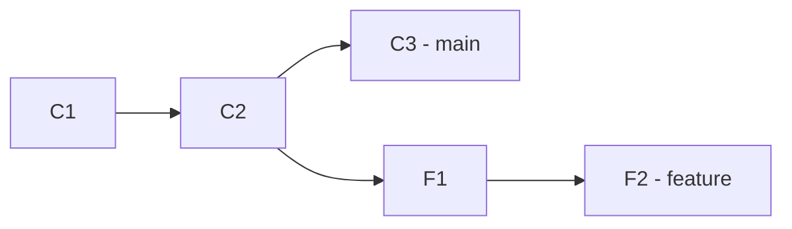
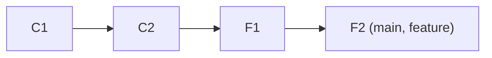
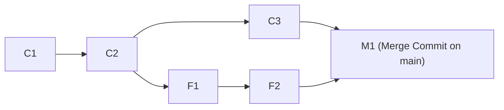
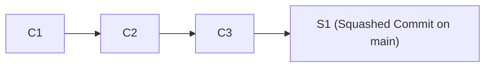
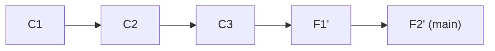

# Lesson 02: Merge Strategies — Fast-Forward, Merge Commits, Squash & Rebase

---

## 1. Learning Objective
Master the exact DAG transformations, mechanics, and architectural trade-offs of the 4 core Git merge strategies: **Fast-Forward (`--ff`)**, **Explicit Merge Commits (`--no-ff`)**, **Squash and Merge**, and **Rebase and Merge**.

---

## 2. Why This Matters
Teams engage in heated debates over "Merge vs. Rebase vs. Squash." Without understanding the underlying DAG mechanics, developers accidentally duplicate commits, create confusing "train-track" history webs, or destroy bisectability with bad squash practices. Mastering merge strategies lets you choose the right pattern for each project.

---

## 3. Prerequisites
- Completed [Lesson 01: Branching Strategies](01-branching-strategies-github-flow-vs-trunk.md).
- Understanding of the Git DAG and parent commit pointers.

---

## 4. Concept Explanation: The 4 DAG Transformations

### Initial State: Divergent Branches
`main` has advanced with `C3`, while `feature` branched from `C2` and added `F1` and `F2`.



---

### 1. Fast-Forward Merge (`--ff`)
*Only possible if `main` has NOT diverged (i.e. `main` is still at `C2`).*
- Git simply moves the `main` pointer forward to `F2`.
- Zero new commit objects are created.



---

### 2. 3-Way Explicit Merge Commit (`--no-ff`)
- Git computes the 3-way merge between the common ancestor (`C2`), `main` (`C3`), and `feature` (`F2`).
- Creates a **new Merge Commit (`M1`)** with **two parent pointers**: Parent 1 (`C3`) and Parent 2 (`F2`).
- **Preserves true historical chronology** and the exact branch lifespan.



---

### 3. Squash and Merge
- Git takes all changes introduced by `F1` and `F2`, combines them into a single snapshot, and creates a **single new commit (`S1`)** on top of `C3`.
- `S1` has only **one parent pointer** (`C3`).
- The intermediate commits (`F1`, `F2`) are discarded from `main`'s history.



---

### 4. Rebase and Merge
- Git takes `F1` and `F2`, finds their diffs, and **replays** them one-by-one on top of `C3`.
- Creates **new commit objects (`F1'`, `F2'`)** with new timestamps and new SHA hashes.
- Produces a **strictly linear, unbroken history** while preserving individual commit messages.



---

## 5. Architectural Trade-offs Matrix

| Merge Strategy | History Style | Reversibility (`git revert`) | `git bisect` Impact | Traceability of WIP |
| :--- | :--- | :--- | :--- | :--- |
| **Merge Commit (`--no-ff`)** | True Historical Web | Revert 1 merge commit reverts entire PR | Can land on broken intermediate commits | High (All raw WIP commits retained) |
| **Squash and Merge** | Linear (1 commit/PR) | Trivially clean (1 commit = 1 PR) | Perfect (Every commit is a green PR) | Low (WIP commit details erased) |
| **Rebase and Merge** | Linear (Multi-commit) | Requires reverting multiple commits | Excellent if commits are atomic | High (Keeps individual commits) |
| **Fast-Forward (`--ff`)** | Pure Linear | Simple | Depends on commit quality | High |

---

## 6. Real-World Use Case
- **Squash and Merge**: Preferred for high-velocity web repositories where pull requests contain messy exploratory commits ("fix typo", "fix tests", "wip"). Squashing keeps `main` clean and atomic.
- **Merge Commit (`--no-ff`)**: Required in regulated industries (medical, defense) where audit compliance mandates keeping exact historical timestamps and original author signatures.
- **Rebase and Merge**: Preferred in open-source kernel projects (Linux, Git) where maintainers require a linear commit log of carefully sculpted, atomic patches.

---

## 7. Official GitHub Documentation
- [GitHub Docs: About merge methods on GitHub](https://docs.github.com/en/pull-requests/collaborating-with-pull-requests/incorporating-changes-from-a-pull-request/about-merge-methods-on-github)
- [Pro Git Book: Git Branching - Basic Branching and Merging](https://git-scm.com/book/en/v2/Git-Branching-Basic-Branching-and-Merging)
- [Pro Git Book: Git Branching - Rebasing](https://git-scm.com/book/en/v2/Git-Branching-Rebasing)

---

## 8. Recommended High-Quality External Resource
- **Resource**: *Merge vs. Rebase: The Architectural Guide* by Atlassian Git Guides.
- **Why it helps**: Step-by-step visual comparisons of DAG ref pointer movements.

---

## 9. Step-by-Step Demonstration

### 1. Execute a Standard 3-Way Merge
```bash
mkdir merge-demo && cd merge-demo && git init
echo "base" > file.txt && git add file.txt && git commit -m "c1: base"
git checkout -b feature
echo "feature work" >> file.txt && git commit -am "feat: feature change"
git checkout main
echo "main hotfix" > hotfix.txt && git add hotfix.txt && git commit -m "fix: main hotfix"

# Perform 3-way merge
git merge --no-ff feature -m "merge: incorporate feature branch"
git log --graph --oneline
```

### 2. Execute a Rebase
```bash
git checkout -b feature-rebase main
echo "rebase work 1" > file2.txt && git add file2.txt && git commit -m "feat: part 1"
echo "rebase work 2" >> file2.txt && git commit -am "feat: part 2"

# Rebase feature on top of main
git rebase main
git log --graph --oneline
```

### 3. Execute a Squash Merge
```bash
git checkout main
git checkout -b feature-squash
echo "wip 1" > file3.txt && git add file3.txt && git commit -m "wip 1"
echo "wip 2" >> file3.txt && git commit -am "wip 2"

git checkout main
# Squash merge all commits into 1
git merge --squash feature-squash
git commit -m "feat: complete feature-squash in one atomic commit"
git log -1 --stat
```

---

## 10. Hands-on Lab
Refer to [`../labs/03-branching-and-conflict-surgery-lab.md`](../labs/03-branching-and-conflict-surgery-lab.md).

---

## 11. Challenge
**Challenge**: You have a pull request with 15 messy commits. You want to merge it into `main` using **Rebase and Merge**, but you want only 2 clean, logical commits to appear on `main`. What workflow must you execute before clicking merge?
*(Answer: Run interactive rebase `git rebase -i main` locally to squash the 15 commits into 2 clean commits, force-push to the PR branch, then merge).*

---

## 12. Common Mistakes & Gotchas
- **Mistake 1**: Rebasing a public branch that other team members have checked out. (*Result: Divergent histories and broken teammate branches.*)
- **Mistake 2**: Squashing a PR that legitimately contained 3 distinct, independent features. (*Result: Inability to revert one feature without reverting all three.*)
- **Mistake 3**: Blindly merging without testing the merge resolution locally first.

---

## 13. Professional Practices
- **Configure Repository Merge Buttons**: In GitHub repository settings, disable merge methods that your team does not practice (e.g. enable ONLY "Allow squash merging" to enforce linear history).
- **Auto-Delete Head Branches**: Enable "Automatically delete head branches" under repository settings.

---

## 14. Security Considerations
- **Commit Signature Loss on Squash**: When GitHub performs a Squash and Merge on the web UI, GitHub signs the new squashed commit with GitHub's web-flow key, replacing individual local developer SSH/GPG signatures unless configured via API/CLI.

---

## 15. Interview Questions & Progression

1. **[WHAT]**: What is the difference between a Fast-Forward merge and a 3-Way Merge Commit?
   - *Answer*: A Fast-Forward merge simply moves the branch pointer forward without creating a commit; a 3-Way merge creates a new commit object with two parent pointers.
2. **[HOW]**: How does `git rebase` transform commit history?
   - *Answer*: It recalculates the diff of each commit on the current branch and replays them one-by-one onto the new base commit, generating new commit SHA hashes.
3. **[WHY]**: Why do high-scale SaaS teams often prefer Squash and Merge on GitHub?
   - *Answer*: Because it keeps the `main` branch commit history 1:1 with Pull Requests, making `git bisect` and rollbacks trivial.
4. **[WHAT IF]**: What happens if you run `git merge` when there are divergent commits on both branches?
   - *Answer*: Git automatically initiates a 3-way merge; if changes overlap on the same lines, it halts with a Merge Conflict.
5. **[TRADE-OFFS]**: What are the trade-offs of a linear rebased history vs. a true merge commit history?
   - *Answer*: Linear history makes reading logs, bisecting, and cherry-picking easier; merge commit history preserves true historical context, timestamps, and multi-commit PR groupings.

---

## 16. Real-World Scenario
A core API library broke in production after a release. The on-call engineer used `git bisect` to locate the offending commit in under 2 minutes because the repository enforced a **Squash and Merge** policy where every commit on `main` was a single, green, fully tested PR. Running `git revert <commit-sha>` rolled back the broken feature with 1 command.

---

## 17. Assessment
Complete the evaluation in [`../assessments/03-branching-assessment.md`](../assessments/03-branching-assessment.md).

---

## 18. Mastery Criteria
- [ ] Can draw and explain the DAG for all 4 merge strategies.
- [ ] Knows when to use Squash vs Rebase vs Merge Commit.
- [ ] Understands the implications of new SHA generation during rebasing.
- [ ] Can configure GitHub repository merge defaults.

---

## 19. Further Exploration
- Explore `git merge-base main feature` to find the common ancestor commit.
- Learn about Octopus merges (`git merge feat1 feat2 feat3` with $>2$ parents).
