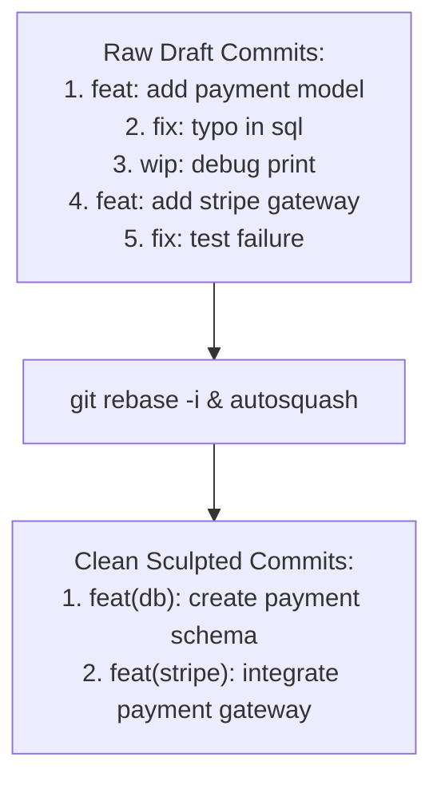
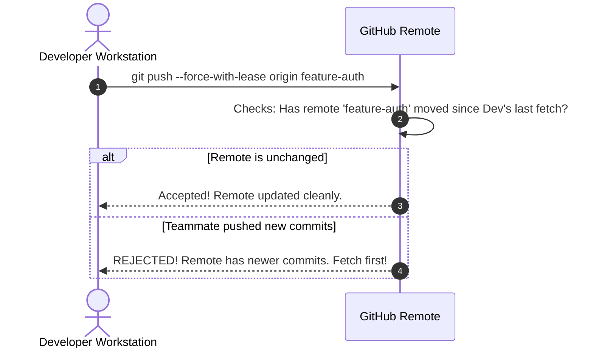

# Lesson 03: Interactive Rebasing & History Crafting

---

## 1. Learning Objective
Master **Interactive Rebasing (`git rebase -i`)** to sculpt clean, professional commit histories. Learn to `reword`, `squash`, `fixup`, `edit`, `split`, `reorder`, and `drop` commits, leverage `--autosquash`, and safely update remote PRs using **`--force-with-lease`**.

---

## 2. Why This Matters
During local development, commits are naturally messy: "wip", "fixed typo", "trying again", "debug log". Pushing raw exploratory commits creates noisy PRs that waste reviewer time. Interactive rebasing gives developers the power to rewrite local draft history into a polished, story-driven sequence of atomic patches before code review.

---

## 3. Prerequisites
- Completed [Lesson 02: Merge Strategies](02-merge-strategies-ff-squash-rebase.md).
- Understanding of the Git DAG and commit parent pointers.

---

## 4. Concept Explanation

### The Interactive Rebase Command Sheet
Running `git rebase -i HEAD~N` or `git rebase -i origin/main` opens an editor with a script of commits ordered chronologically (oldest at top, newest at bottom):

```text
# Commands:
# p, pick <commit> = use commit
# r, reword <commit> = use commit, but edit the commit message
# e, edit <commit> = use commit, but stop for amending
# s, squash <commit> = meld into previous commit (concatenates messages)
# f, fixup <commit> = like "squash", but discard this commit's log message
# x, exec <command> = run command (the rest of the line) using shell
# d, drop <commit> = remove commit
```



### Advanced Technique: Splitting a Commit
1. Mark the target commit as `edit` in the rebase todo list.
2. When Git pauses at the commit, reset the commit while keeping working files intact:
   `git reset HEAD~1`
3. Stage and commit the first atomic piece:
   `git add -p` $\to$ `git commit -m "feat: part 1"`
4. Stage and commit the second atomic piece:
   `git add .` $\to$ `git commit -m "feat: part 2"`
5. Continue the rebase:
   `git rebase --continue`

### The `--autosquash` Instant Workflow
Instead of manually editing the rebase todo list:
1. Make a small fix to an older commit:
   `git commit --fixup <target-commit-sha>`
2. Rebase automatically:
   `git rebase -i --autosquash origin/main`
Git automatically positions the fixup commit directly below the target commit and marks it as `fixup`!

---

## 5. Mental Model: Safe Force Pushing with `--force-with-lease`

> [!CAUTION]
> Never use raw `git push --force`! Raw force-pushing overwrites remote history unconditionally, destroying teammates' commits if they pushed in the interim.
> Always use **`git push --force-with-lease`**—it verifies that the remote branch has not changed since you last fetched before overwriting.



---

## 6. Real-World Use Case
Before submitting a PR for a 400-line Linux kernel patch, an engineer uses `git rebase -i main` to reorganize 12 draft commits into 3 distinct, self-contained commits: (1) Architecture header definitions, (2) Core driver implementation, (3) Unit test suite with `exec pytest`. Reviewers approve the PR in 1 cycle because each commit is independently testable and bisectable.

---

## 7. Official GitHub Documentation
- [Pro Git Book: Rewriting History](https://git-scm.com/book/en/v2/Git-Tools-Rewriting-History)
- [Pro Git Book: Git Tools - Interactive Rebasing](https://git-scm.com/book/en/v2/Git-Tools-Rewriting-History#_git_rebase_i)

---

## 8. Recommended High-Quality External Resource
- **Resource**: *Git Rebase in Depth* by Julia Evans (Wizard Zines).
- **Why it helps**: Visual, intuitive diagrams explaining how commits are plucked, amended, and re-stitched onto a new base.

---

## 9. Step-by-Step Demonstration

### 1. Create a Messy Commit History
```bash
mkdir rebase-demo && cd rebase-demo && git init
echo "init" > file.txt && git add file.txt && git commit -m "feat: initial commit"

# Draft commits
echo "auth skeleton" > auth.py && git add auth.py && git commit -m "feat: add auth"
echo "fixed typo" >> auth.py && git add auth.py && git commit -m "fix typo"
echo "debug log" >> auth.py && git add auth.py && git commit -m "wip: debug log"
```

### 2. Clean Up with `git rebase -i`
```bash
git rebase -i HEAD~3
```
In the editor, modify the todo list:
```text
pick <sha1> feat: add auth
fixup <sha2> fix typo
drop <sha3> wip: debug log
```
Save and close the editor. Inspect the clean log:
```bash
git log --oneline
# Only 2 clean commits remain!
```

### 3. Automated Fixup Workflow
```bash
# Get the SHA of the auth commit
AUTH_SHA=$(git rev-parse HEAD)

# Make a small bug fix
echo "# Auth helper" >> auth.py
git commit --fixup $AUTH_SHA

# Rebase with autosquash
git rebase -i --autosquash HEAD~2
```

---

## 10. Hands-on Lab
Refer to [`../labs/03-branching-and-conflict-surgery-lab.md`](../labs/03-branching-and-conflict-surgery-lab.md).

---

## 11. Challenge
**Challenge**: You have a commit containing both a bugfix in `app.py` and an unrelated database migration in `migration.sql`. Use `git rebase -i` with the `edit` verb to split this commit into two separate, atomic commits.

---

## 12. Common Mistakes & Gotchas
- **Mistake 1**: Deleting a line in the interactive rebase todo list expecting it to keep the commit. (*Gotcha: Deleting a line DROPS the commit! To keep it, use `pick`*).
- **Mistake 2**: Changing the very first commit to `squash`. (*Error: A commit cannot be squashed into nothing; the first commit in the list must be `pick` or `reword`*).
- **Mistake 3**: Rebasing shared public branches.

---

## 13. Professional Practices
- **Configure Autosquash Globally**: Enable auto-squash by default:
  `git config --global rebase.autoSquash true`
- **Use `exec` for Test Verification**: Add `exec npm test` to ensure every commit in your branch builds and passes tests:
  `git rebase -i --exec "pytest" origin/main`

---

## 14. Security Considerations
- **Scrubbing Accidental Secrets in Draft Commits**: If you accidentally committed a token in a local draft commit, `git rebase -i` with `drop` or `squash` (and editing) purges the token before it is ever pushed to GitHub.

---

## 15. Interview Questions & Progression

1. **[WHAT]**: What is the difference between `squash` and `fixup` in an interactive rebase?
   - *Answer*: `squash` combines the commit into the previous one and prompts you to merge both commit messages; `fixup` combines the changes but automatically discards the fixup commit's message.
2. **[HOW]**: How do you split a single historical commit into two distinct commits?
   - *Answer*: Mark the commit with `edit` in `git rebase -i`, run `git reset HEAD~1` when paused, create two separate commits using `git add -p` / `git commit`, then run `git rebase --continue`.
3. **[WHY]**: Why is `git push --force-with-lease` safer than `git push --force`?
   - *Answer*: It checks whether the remote ref has been updated by someone else since your last fetch, preventing you from accidentally overwriting a teammate's commits.
4. **[WHAT IF]**: What happens if an interactive rebase encounters a conflict halfway through?
   - *Answer*: Git pauses the rebase, leaves conflict markers in the affected files, and waits for you to resolve the conflict and run `git rebase --continue` (or abort with `git rebase --abort`).
5. **[TRADE-OFFS]**: What are the trade-offs of rewriting local history before opening a PR?
   - *Answer*: Creates clean, readable, bisectable history for reviewers at the cost of a few minutes of developer time and needing to force-push the feature branch.

---

## 16. Real-World Scenario
A developer working on a large PR made 25 commits over 4 days. Before requesting review from senior architects, they ran `git rebase -i origin/main`, squashing 15 typo/debug commits, reordering documentation commits to the front, and running `exec npm test`. The reviewers reviewed 4 clean, logical commits in 10 minutes instead of wading through 25 messy commits.

---

## 17. Assessment
Complete the evaluation in [`../assessments/03-branching-assessment.md`](../assessments/03-branching-assessment.md).

---

## 18. Mastery Criteria
- [ ] Confidently uses `pick`, `reword`, `squash`, `fixup`, `drop`, and `edit`.
- [ ] Can split a historical commit into atomic units.
- [ ] Uses `commit --fixup` and `rebase --autosquash`.
- [ ] Understands and enforces `git push --force-with-lease`.

---

## 19. Further Exploration
- Explore `git rebase -i --root` to rebase from the very first commit of a repository.
- Learn about `git absorb` (third-party tool that automatically fixups modifications to the right commits).
