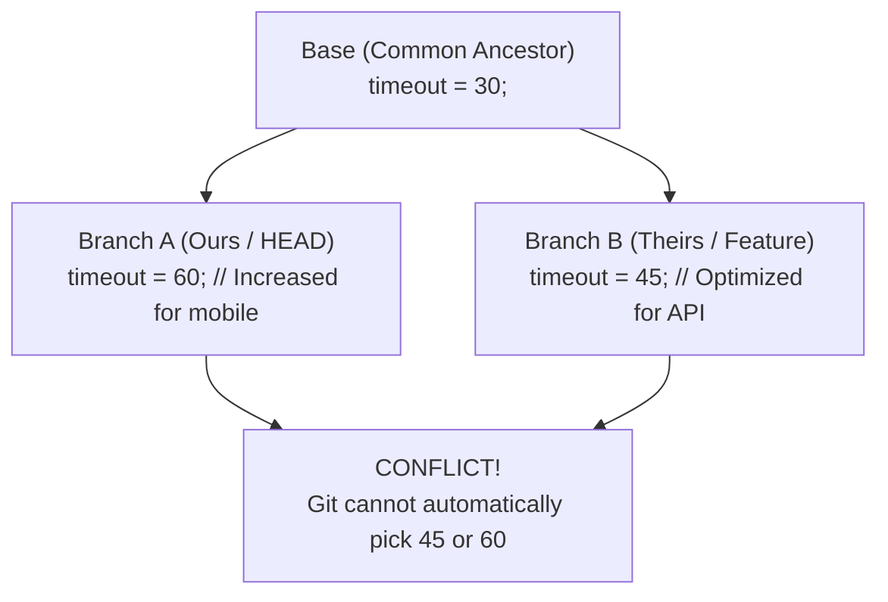
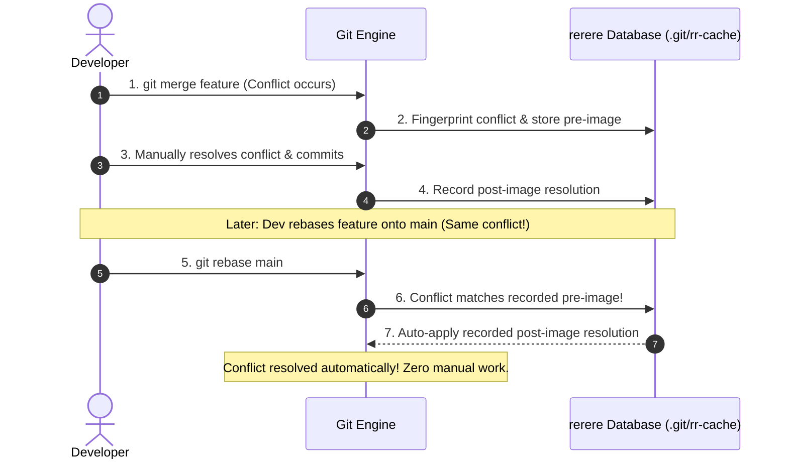

# Lesson 04: Merge Conflict Surgery & Automated Resolution with `git rerere`

---

## 1. Learning Objective
Perform surgical **3-way merge conflict resolution** using `merge.conflictstyle zdiff3`, understand conflict marker anatomy, and automate repeating conflict resolution across long-lived branches using **`git rerere`** (Reuse Recorded Resolution).

---

## 2. Why This Matters
Merge conflicts are the most dreaded event for junior developers. Without seeing what the original code looked like before both branches modified it, resolving conflicts feels like blind guesswork. Configuring `zdiff3` reveals the common ancestor base, and enabling `git rerere` prevents you from having to solve the exact same conflict twice when rebasing.

---

## 3. Prerequisites
- Completed [Lesson 02: Merge Strategies](02-merge-strategies-ff-squash-rebase.md) and [Lesson 03: Interactive Rebasing](03-interactive-rebase-and-history-crafting.md).
- Understanding of 3-way merges and the common ancestor commit.

---

## 4. Concept Explanation

### Anatomy of a 3-Way Merge Conflict
A conflict occurs when two branches modify the **same lines of a file** differently since their **Common Ancestor (`merge-base`)**.



### The Standard vs. `zdiff3` Conflict Marker View

#### Standard View (`merge.conflictstyle merge`):
```text
<<<<<<< HEAD (Ours / Current Branch)
timeout = 60; // Increased for mobile
=======
timeout = 45; // Optimized for API
>>>>>>> feature-api (Theirs / Incoming Branch)
```
*Problem*: You cannot see what the code looked like originally!

#### The `zdiff3` Superpower (`merge.conflictstyle zdiff3`):
```text
<<<<<<< HEAD
timeout = 60; // Increased for mobile
||||||| base:config.ts
timeout = 30;
=======
timeout = 45; // Optimized for API
>>>>>>> feature-api
```
*Clarity*: You immediately see that the base was `30`, Branch A wanted `60`, and Branch B wanted `45`. You can intelligently reconcile them to `timeout = Math.max(60, 45);`.

---

### What is `git rerere` (Reuse Recorded Resolution)?
`git rerere` stands for **Reuse Recorded Resolution**.
- When enabled, Git takes a fingerprint of the conflicted file before you resolve it (**pre-image**).
- When you finish resolving and commit, Git records your resolution (**post-image**).
- If Git ever encounters that exact same conflict again (e.g. during a rebase with 10 commits, or merging into a staging branch), Git **automatically applies your saved resolution!**



---

## 5. Mental Model: Enabling Global Conflict Tooling

```bash
# 1. Enable zdiff3 for crystal-clear 3-way conflict markers
git config --global merge.conflictstyle zdiff3

# 2. Enable git rerere globally to record resolutions
git config --global rerere.enabled true

# 3. Automatically stage rerere-resolved conflicts
git config --global rerere.autoupdate true
```

---

## 6. Real-World Use Case
An engineer maintains a long-running feature branch `v2-redesign` that diverges from `main` by 40 commits. Every week, they rebase `v2-redesign` onto `main`. Without `rerere`, they must solve the same 12 merge conflicts on every single rebase. With `git rerere.enabled true`, Git auto-resolves all 12 conflicts in under 1 second.

---

## 7. Official GitHub Documentation
- [Pro Git Book: Git Tools - Advanced Merging](https://git-scm.com/book/en/v2/Git-Tools-Advanced-Merging)
- [Pro Git Book: Git Tools - Rerere](https://git-scm.com/book/en/v2/Git-Tools-Rerere)

---

## 8. Recommended High-Quality External Resource
- **Resource**: *Fixing Conflicts with Git Rerere* by Nicola Paolucci (Atlassian).
- **Why it helps**: Step-by-step walkthrough of `.git/rr-cache` internals and automated replay.

---

## 9. Step-by-Step Demonstration

### 1. Initialize Sandbox and Enable Tools
```bash
mkdir conflict-demo && cd conflict-demo && git init
git config merge.conflictstyle zdiff3
git config rerere.enabled true

# Create common base
cat << 'EOF' > server.ts
export const PORT = 3000;
export const TIMEOUT = 30;
export const MAX_CONN = 100;
EOF
git add server.ts && git commit -m "c1: base config"
```

### 2. Create Branch A (Ours)
```bash
git checkout -b branch-a
cat << 'EOF' > server.ts
export const PORT = 3000;
export const TIMEOUT = 60; // Increased for mobile
export const MAX_CONN = 100;
EOF
git commit -am "feat: increase timeout for mobile"
```

### 3. Create Branch B (Theirs)
```bash
git checkout main
git checkout -b branch-b
cat << 'EOF' > server.ts
export const PORT = 3000;
export const TIMEOUT = 45; // Optimized for cloud
export const MAX_CONN = 200; // Scaled concurrency
EOF
git commit -am "feat: tune timeout and max connections"
```

### 4. Trigger Conflict & Inspect `zdiff3`
```bash
git checkout branch-a
git merge branch-b
# Output: Automatic merge failed; fix conflicts and then commit the result.
# Recorded preimage for 'server.ts'

cat server.ts
```
*Observe the clean 3-way `zdiff3` block*:
```typescript
export const PORT = 3000;
<<<<<<< HEAD
export const TIMEOUT = 60; // Increased for mobile
export const MAX_CONN = 100;
||||||| base:server.ts
export const TIMEOUT = 30;
export const MAX_CONN = 100;
=======
export const TIMEOUT = 45; // Optimized for cloud
export const MAX_CONN = 200; // Scaled concurrency
>>>>>>> branch-b
```

### 5. Resolve Surgically & Record Resolution
```bash
# Reconcile cleanly
cat << 'EOF' > server.ts
export const PORT = 3000;
export const TIMEOUT = 60; // Keep mobile safety
export const MAX_CONN = 200; // Adopt scaled concurrency
EOF

git add server.ts
git commit -m "merge: resolve timeout and connection limits"
# Output: Recorded resolution for 'server.ts'.
```

---

## 10. Hands-on Lab
Refer to [`../labs/03-branching-and-conflict-surgery-lab.md`](../labs/03-branching-and-conflict-surgery-lab.md).

---

## 11. Challenge
**Challenge**: Inspect `.git/rr-cache/` to locate the recorded SHA hash of the conflict resolution you just performed, and inspect the raw pre-image and post-image diffs stored by Git.

---

## 12. Common Mistakes & Gotchas
- **Mistake 1**: Leaving conflict markers (`<<<<<<<`, `=======`, `>>>>>>>`) inside source code and committing. (*Result: Syntax errors and broken builds.*)
- **Mistake 2**: Resolving conflicts in favor of "ours" or "theirs" blindly without checking the base (`zdiff3`).
- **Mistake 3**: Panicking during a rebase conflict. (*Fix: Run `git rebase --abort` to return to your clean pre-rebase state safely.*)

---

## 13. Professional Practices
- **Always Enable `zdiff3`**: Make `merge.conflictstyle zdiff3` standard on all developer workstations.
- **Run Tests Immediately After Merge Resolution**: Semantic bugs can occur even if Git merges text cleanly without conflict markers. Always run tests before pushing.

---

## 14. Security Considerations
- **Accidental Deletion of Security Patches**: During merge conflict resolution, developers often blindly overwrite lines, accidentally erasing security patches introduced on `main`. Always carefully review `git diff` before completing a merge.

---

## 15. Interview Questions & Progression

1. **[WHAT]**: What is the difference between standard conflict markers and `zdiff3` conflict style?
   - *Answer*: Standard conflict markers show only the two conflicting branch versions; `zdiff3` includes a third section showing the original common ancestor base code.
2. **[HOW]**: How does `git rerere` save developer time during multi-commit rebases?
   - *Answer*: It records how a developer resolved a conflict the first time and automatically applies that exact resolution when the same conflict repeats in subsequent rebase steps.
3. **[WHY]**: Why can a merge conflict occur even if two developers modified different functions in the same file?
   - *Answer*: If the functions are close to each other, Git's diff chunk algorithm may group them into a single overlapping hunk.
4. **[WHAT IF]**: What should you do if you realize you made a terrible mistake halfway through resolving a complex merge?
   - *Answer*: Execute `git merge --abort` (or `git rebase --abort`) to reset the repository back to the exact pre-merge state.
5. **[TRADE-OFFS]**: What are the trade-offs of using `git rerere`?
   - *Answer*: Tremendous time savings during long rebases, but if you record an incorrect/buggy resolution, `rerere` will automatically re-apply the bug until you clear the `.git/rr-cache`.

---

## 16. Real-World Scenario
A team was upgrading a core React component library across 50 files on a feature branch. Over the 2-week sprint, `main` received 80 commits, causing 30 repeated merge conflicts whenever the feature branch was rebased. With `git rerere` enabled, the developer resolved the conflict patterns once on Day 1, and Git auto-resolved 100% of subsequent rebase conflicts for the remainder of the sprint.

---

## 17. Assessment
Complete the evaluation in [`../assessments/03-branching-assessment.md`](../assessments/03-branching-assessment.md).

---

## 18. Mastery Criteria
- [ ] Configures `merge.conflictstyle zdiff3` and understands all 3 parts of the conflict block.
- [ ] Confidently resolves multi-file merge conflicts without leaving markers.
- [ ] Enables and explains `git rerere` mechanics.
- [ ] Safely aborts failed merges and rebases with `--abort`.

---

## 19. Further Exploration
- Explore GUI merge tools (`git mergetool`) configured with VS Code or Meld.
- Learn how `git rerere diff` and `git rerere status` inspect cached resolutions.
