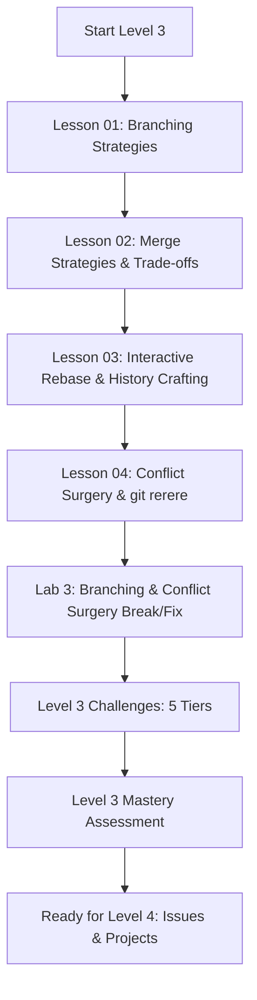
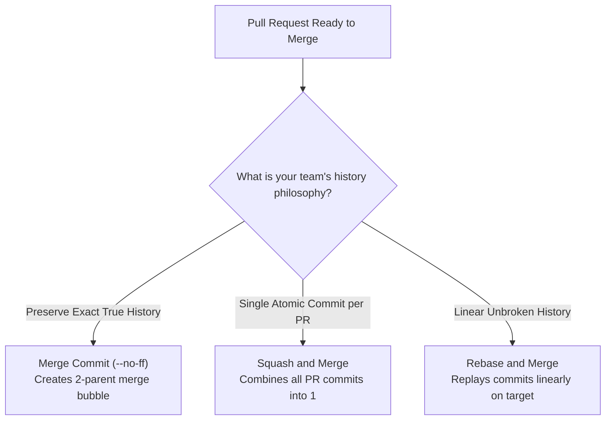

# Level 3 — Branching & Professional Git Workflows

> **Master enterprise branching models, DAG merge strategies, interactive rebasing (`git rebase -i`), 3-way merge conflict surgery, and conflict automation with `git rerere`.**

---

## 🎯 Level Objectives

By the end of this level, you will:
1. Compare and select appropriate branching strategies: **Trunk-Based Development**, **GitHub Flow**, **Git Flow**, and **Release Branching**.
2. Understand the exact DAG transformations, mechanics, and trade-offs of the 4 core merge strategies: **Fast-Forward (`--ff`)**, **Explicit Merge Commits (`--no-ff`)**, **Squash and Merge**, and **Rebase and Merge**.
3. Master interactive rebasing (`git rebase -i`) to squash, reword, edit, split, reorder, and drop commits before opening Pull Requests.
4. Perform surgical **3-way merge conflict resolution** using `merge.conflictstyle zdiff3` to inspect the common ancestor base.
5. Automate repeating conflict resolution using **`git rerere`** (Reuse Recorded Resolution).

---

## 🗺️ Module Curriculum & Roadmap

### Lessons & Materials

| # | Document | Topic & Focus | Depth |
| :---: | :--- | :--- | :---: |
| **01** | [`01-branching-strategies-github-flow-vs-trunk.md`](01-branching-strategies-github-flow-vs-trunk.md) | Trunk-Based vs GitHub Flow vs Git Flow, Short-Lived Branches, Feature Flags | Developer $\to$ Pro |
| **02** | [`02-merge-strategies-ff-squash-rebase.md`](02-merge-strategies-ff-squash-rebase.md) | Fast-Forward, 3-Way Merge Commits, Squash & Merge, Rebase & Merge | Developer $\to$ Pro |
| **03** | [`03-interactive-rebase-and-history-crafting.md`](03-interactive-rebase-and-history-crafting.md) | `git rebase -i` Commands, Squash, Fixup, Edit, Split, Golden Rule of Rebasing | Developer $\to$ Pro |
| **04** | [`04-merge-conflict-surgery-and-rerere.md`](04-merge-conflict-surgery-and-rerere.md) | 3-Way Merge Anatomy, `zdiff3` Base Inspection, `git rerere` Recording & Replay | Developer $\to$ Pro |
| **Lab** | [`../labs/03-branching-and-conflict-surgery-lab.md`](../labs/03-branching-and-conflict-surgery-lab.md) | Multi-File Merge Conflicts, Rebase Failure Recovery, `git rerere` Automation | Hands-On |
| **Chal** | [`../challenges/03-branching-challenges.md`](../challenges/03-branching-challenges.md) | 5-Tier Challenges (History Sculpting, Atomic Splits, Long-Lived Rebase) | Tier 1–5 |
| **Quiz** | [`../assessments/03-branching-assessment.md`](../assessments/03-branching-assessment.md) | DAG Transformation Diagnostics, Conflict Surgery & Mastery Rubric | Evaluation |

---

## 🧠 Core Mental Models in this Level

### 1. Merge Strategies Decision Matrix

### 2. The Golden Rule of Rebasing
> [!CAUTION]
> **Never rebase commits that exist outside your local repository and that other developers are building on.**
> Rebasing creates brand new commit SHA hashes. If you rebase shared public commits, you rewrite history and force teammates into divergent DAG conflicts.

---

## ✅ Level 3 Mastery Checklist

Before advancing to [Level 4: Issues, Projects & Collaboration](../04-issues-projects/), verify you can:
- [ ] Articulate when to use Trunk-Based Development vs. GitHub Flow vs. Git Flow.
- [ ] Compare the DAG graphs of Fast-Forward, 3-Way Merge, Squash, and Rebase.
- [ ] Confidently execute `git rebase -i` to clean up messy local commits before opening PRs.
- [ ] Configure `merge.conflictstyle zdiff3` and resolve multi-file merge conflicts cleanly.
- [ ] Enable and utilize `git rerere` to auto-resolve repeating merge conflicts across long-running branches.
- [ ] Recover from stuck or aborted rebases using `git rebase --abort` and `git reflog`.
- [ ] Score 100% on the [Level 3 Assessment](../assessments/03-branching-assessment.md).
