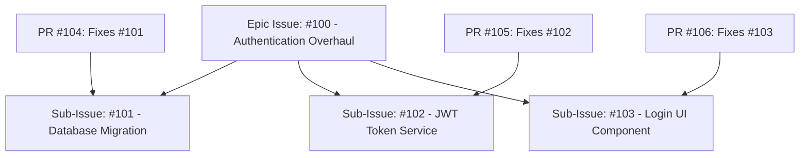

# Lesson 01: GitHub Issues, Tasklists & Sub-Issue Hierarchies

---

## 1. Learning Objective
Master the **GitHub Issues** lifecycle, engineer nested **Tasklists & Sub-Issues**, cross-reference commits and pull requests, manage issue governance (pinning, locking, transferring), and leverage automated **Issue Closing Keywords**.

---

## 2. Why This Matters
In professional software development, unorganized issue trackers turn into chaotic dumping grounds of duplicate bugs and forgotten tasks. Mastering structured tasklists and automated closing keywords establishes clear execution tracking and ensures issues update automatically as code merges.

---

## 3. Prerequisites
- Completed [Level 2: Repository Mastery & Issue Forms](../02-repositories/).
- Completed [Level 3: Branching & Merge Workflows](../03-branching-workflows/).

---

## 4. Concept Explanation

### The Anatomy of an Issue
An issue is an actionable record containing:
- **State**: Open or Closed (with reason: *Completed* or *Not Planned*).
- **Assignees**: Up to 10 developers responsible for execution.
- **Labels**: Metadata tags for categorization and automated triage.
- **Milestone**: Target sprint or version deadline.
- **Projects**: Associated GitHub Projects v2 boards.
- **Development**: Linked Pull Requests and feature branches.

### Tasklists & Sub-Issues
GitHub supports dynamic markdown tasklists that track progress and can be converted into standalone linked sub-issues:

```markdown
### Implementation Tasks
- [x] #101 (Database migration)
- [x] #102 (API endpoint)
- [ ] #103 (Frontend UI components)
- [ ] Write end-to-end integration tests
```
When tasklists reference other issues (`#101`), GitHub renders an interactive completion bar (e.g. `2 of 4 tasks`) at the top of the issue.



---

### Automated Closing Keywords
When a Pull Request description contains a recognized closing keyword followed by an issue reference, merging the PR into the **default branch (`main`)** automatically closes the target issue!

#### Recognized Keywords:
- `close`, `closes`, `closed`
- `fix`, `fixes`, `fixed`
- `resolve`, `resolves`, `resolved`

#### Multiple Issue Closing Syntax:
```markdown
This PR completes the checkout refactor.
Closes #45, fixes #46, and resolves owner/repo#78.
```

> [!IMPORTANT]
> **The Default Branch Rule**:
> If a PR is merged into a non-default branch (e.g. `dev` or `release/v2`), GitHub links the issue but does **NOT** close it. The issue closes only when that code reaches the default branch (`main`).

---

## 5. Mental Model: Issue Governance

- **Pinning Issues**: Pin up to 3 high-priority issues to the top of the repository issue list (ideal for Roadmaps, Master Tracking Epics, or Breaking Announcements).
- **Locking Issues**: Lock conversation to maintainers when discussions become heated, off-topic, or resolved.
- **Transferring Issues**: Move an issue seamlessly to another repository within the same organization while preserving all comments, timestamps, and subscribers.

---

## 6. Real-World Use Case
A team lead creates an Epic Issue (`#250: Payment Gateway v2`) containing a 6-item tasklist referencing individual sub-issues. Three backend engineers work in parallel on 3 separate feature branches. As each engineer's PR merges into `main` using `Fixes #251`, GitHub updates the progress bar on the parent Epic Issue in real-time (`1 of 6` $\to$ `2 of 6` $\to$ `3 of 6`).

---

## 7. Official GitHub Documentation
- [GitHub Docs: About issues](https://docs.github.com/en/issues/tracking-your-work-with-issues/about-issues)
- [GitHub Docs: Linking a pull request to an issue](https://docs.github.com/en/issues/tracking-your-work-with-issues/linking-a-pull-request-to-an-issue)
- [GitHub Docs: About tasklists](https://docs.github.com/en/get-started/writing-on-github/working-with-advanced-formatting/about-tasklists)

---

## 8. Recommended High-Quality External Resource
- **Resource**: *Effective Project Management with GitHub Issues* by Martin Woodward (GitHub).
- **Why it helps**: Walkthrough of tasklist hierarchies and cross-linking strategies in large-scale projects.

---

## 9. Step-by-Step Demonstration

### 1. Creating an Issue via GitHub CLI (`gh`)
```bash
# Create an issue with title, body, labels, and assignee
gh issue create \
  --title "feat: implement user registration endpoint" \
  --body "### Objective\nCreate POST /api/register with input validation.\n\n- [ ] Database schema\n- [ ] Password hashing\n- [ ] Route handler" \
  --label "enhancement,backend" \
  --assignee "@me"
```

### 2. Linking PR to Issue with Auto-Close
```bash
# Create feature branch
git checkout -b feat/registration

# Commit changes
echo "def register(): pass" > register.py
git add register.py
git commit -m "feat(auth): add register function"
git push -u origin feat/registration

# Create Pull Request linked to Issue #1
gh pr create \
  --title "feat(auth): implement user registration endpoint" \
  --body "Implements input validation and user model persistence.\n\nCloses #1"
```

### 3. Pinning and Locking an Issue
```bash
# Pin high-priority issue #1
gh issue pin 1

# Lock issue to prevent off-topic comments
gh issue lock 1 --reason "resolved"
```

---

## 10. Hands-on Lab
Refer to [`../labs/04-issues-projects-and-automation-lab.md`](../labs/04-issues-projects-and-automation-lab.md).

---

## 11. Challenge
**Challenge**: Write a single Pull Request description that references 3 different issues in the current repository and 1 issue in an external repository (`octo-org/infra-core`), closing all 4 automatically upon merge into `main`.

---

## 12. Common Mistakes & Gotchas
- **Mistake 1**: Writing `Closes #10, #11, #12`. (*Gotcha: GitHub will only close `#10`! You must repeat the keyword: `Closes #10, closes #11, closes #12`*).
- **Mistake 2**: Expecting `Fixes #123` in a commit message to close an issue when merged into a feature branch. (*Reality: Only merges to default `main` trigger auto-close*).
- **Mistake 3**: Closing an issue as "Completed" when it was rejected or abandoned. (*Fix: Use "Close as not planned" to keep analytics accurate*).

---

## 13. Professional Practices
- **Use Epic Parent Issues**: Group related sub-tasks into a single parent tracking issue with tasklists.
- **Reference Commits Explicitly**: When fixing a regression, mention the offending commit hash (`Regressed in commit abc1234`) to link the audit trail.

---

## 14. Security Considerations
- **Private Data in Public Issues**: Never paste raw customer logs, PII, or internal tokens in issue descriptions. Use redacted logs.

---

## 15. Interview Questions & Progression

1. **[WHAT]**: What are the official keywords that automatically close a GitHub issue from a PR?
   - *Answer*: `close`, `closes`, `closed`, `fix`, `fixes`, `fixed`, `resolve`, `resolves`, `resolved`.
2. **[HOW]**: How do you close multiple issues from a single Pull Request description?
   - *Answer*: Repeat the keyword before each issue number: `Fixes #1, fixes #2, closes #3`.
3. **[WHY]**: Why does GitHub only close issues when PRs merge into the *default branch*?
   - *Answer*: Because feature branches do not represent deployed or integrated production code; code is only considered resolved when merged into the main release trunk.
4. **[WHAT IF]**: What happens if an issue is referenced across different repositories in an organization?
   - *Answer*: You reference it using `owner/repository#issue_number`, creating an active cross-repository hyperlink and mention.
5. **[TRADE-OFFS]**: What are the trade-offs of closing an issue as "Completed" vs. "Not Planned"?
   - *Answer*: "Completed" implies delivered value; "Not Planned" (grey icon) preserves historic context without skewing team velocity and burndown charts.

---

## 16. Real-World Scenario
A mobile app team discovered a memory leak in `v3.2.0`. The maintainer created Issue `#400` ("Investigate iOS memory leak") and pinned it. A developer discovered the bug was caused by an upstream library. Rather than deleting `#400`, the maintainer transferred the issue to the upstream repository `company/ios-sdk`, transferring all comments, profiling data, and subscriber notifications instantly.

---

## 17. Assessment
Complete the evaluation in [`../assessments/04-issues-projects-assessment.md`](../assessments/04-issues-projects-assessment.md).

---

## 18. Mastery Criteria
- [ ] Understands the full issue lifecycle (Open, In Progress, Closed as Completed/Not Planned).
- [ ] Builds nested markdown tasklists and tracks sub-issue progress.
- [ ] Correctly uses auto-closing keywords for single and multi-issue linking.
- [ ] Understands issue pinning, locking, and cross-repo transfer mechanics.

---

## 19. Further Exploration
- Explore GitHub GraphQL API queries for batch-extracting issue metrics.
- Learn about GitHub Sub-Issues feature hierarchy in GitHub Enterprise.
