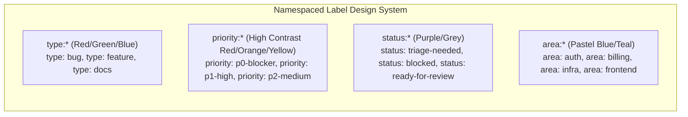
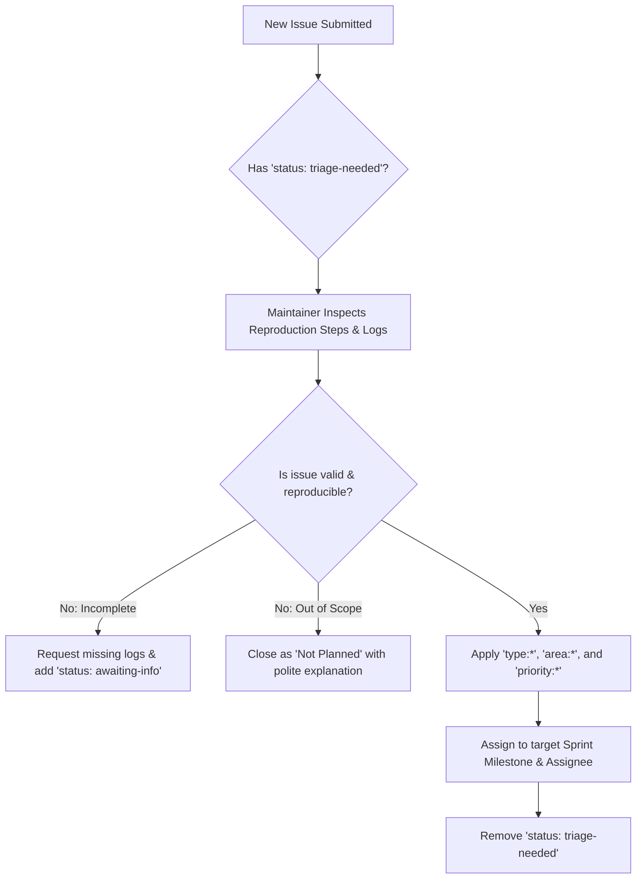

# Lesson 02: Label Taxonomies, Milestones & Issue Triage

---

## 1. Learning Objective
Design a scalable, standardized **Label Taxonomy System**, configure sprint **Milestones** with due dates and burndown tracking, and execute an efficient **Issue Triage Workflow**.

---

## 2. Why This Matters
Repositories with unstandardized labels (e.g. mixing `bug`, `BUG`, `bug-fix`, `broken`) quickly become impossible to filter, search, or automate. A namespaced, color-coded label system paired with sprint milestones gives engineering leadership instant visibility into blockers, velocity, and release timelines.

---

## 3. Prerequisites
- Completed [Lesson 01: GitHub Issues & Tasklists](01-github-issues-and-tasklists.md).
- Understanding of agile sprint planning and issue lifecycles.

---

## 4. Concept Explanation

### The Namespaced Label Taxonomy System
Professional teams avoid flat, arbitrary label names in favor of **namespaced prefixes** with consistent color-coding:



### Standardized Label Schema

| Prefix | Label Name | Color (Hex) | Purpose |
| :--- | :--- | :---: | :--- |
| `type:` | `type: bug` | `#d73a4a` (Red) | Defect or unexpected failure |
| `type:` | `type: feature` | `#a2eeef` (Cyan) | New user-facing functionality |
| `type:` | `type: security` | `#b60205` (Dark Red) | Security vulnerability or compliance fix |
| `type:` | `type: docs` | `#0075ca` (Blue) | Documentation and technical guides |
| `priority:` | `priority: p0-blocker` | `#b60205` (Dark Red) | Production outage / blocking release |
| `priority:` | `priority: p1-high` | `#d93f0b` (Orange) | Critical functionality impaired |
| `priority:` | `priority: p2-medium` | `#fbca04` (Yellow) | Standard priority sprint work |
| `priority:` | `priority: p3-low` | `#0e8a16` (Green) | Minor improvement / nice-to-have |
| `status:` | `status: triage-needed`| `#ededed` (Grey) | New unvetted issue awaiting review |
| `status:` | `status: blocked` | `#e99695` (Salmon) | Blocked by external dependency/team |
| `area:` | `area: auth` | `#5319e7` (Purple) | Identity, OAuth, permissions |
| `area:` | `area: billing` | `#1d76db` (Teal) | Payment processing, subscriptions |

### Special Discovery Labels
- **`good first issue`**: GitHub officially highlights issues with this exact label on `github.com/explore` to attract new contributors.
- **`help wanted`**: Signals that maintainers welcome community pull requests.

---

### Milestones & Sprint Tracking
A **Milestone** groups related issues and pull requests toward a specific delivery deadline (e.g. `v1.2.0 Release` or `Sprint 24: Oct 1 - Oct 14`).
- **Due Date**: Provides deadline tracking and warning indicators for overdue milestones.
- **Burndown Progress**: Automatically displays percentage completion ($X\%$ closed vs $Y\%$ open).

---

## 5. Mental Model: The Issue Triage Funnel



---

## 6. Real-World Use Case
During a major incident, 30 duplicate bug reports flood the repository. The on-call lead filters issues by `status: triage-needed`, tags the genuine root-cause issue with `type: security` and `priority: p0-blocker`, assigns it to the current milestone `Hotfix-v2.4.1`, and closes the duplicates with a reference link to the primary issue.

---

## 7. Official GitHub Documentation
- [GitHub Docs: Managing labels](https://docs.github.com/en/issues/using-labels-and-milestones-to-track-work/managing-labels)
- [GitHub Docs: About milestones](https://docs.github.com/en/issues/using-labels-and-milestones-to-track-work/about-milestones)
- [GitHub Docs: Finding open issues using search filters](https://docs.github.com/en/search-github/searching-on-github/searching-issues-and-pull-requests)

---

## 8. Recommended High-Quality External Resource
- **Resource**: *Designing a Scalable GitHub Label System* by Dave Lunny.
- **Why it helps**: Detailed color palette rules and automation scripts for provisioning labels across multiple repositories.

---

## 9. Step-by-Step Demonstration

### 1. Provisioning Namespaced Labels via GitHub CLI (`gh`)
```bash
# Create type labels
gh label create "type: bug" --color "d73a4a" --description "Unexpected error or defect" --force
gh label create "type: feature" --color "a2eeef" --description "New feature or enhancement" --force
gh label create "type: security" --color "b60205" --description "Security fix or vulnerability" --force

# Create priority labels
gh label create "priority: p0-blocker" --color "b60205" --description "Production blocker" --force
gh label create "priority: p1-high" --color "d93f0b" --description "High priority work" --force
gh label create "priority: p2-medium" --color "fbca04" --description "Standard priority" --force

# Create status labels
gh label create "status: triage-needed" --color "ededed" --description "Awaiting maintainer triage" --force
```

### 2. Creating a Sprint Milestone
```bash
# Create Milestone for upcoming release
gh milestone create \
  --title "Sprint 24: Core Auth Refactor" \
  --description "Migrate legacy authentication to JWT tokens with multi-tenant support." \
  --due-date "2026-10-31"
```

### 3. Triaging & Assigning Issues
```bash
# Search for untriaged issues
gh issue list --label "status: triage-needed"

# Edit issue to apply triaged metadata
gh issue edit 1 \
  --add-label "type: bug,priority: p1-high,area: auth" \
  --remove-label "status: triage-needed" \
  --milestone "Sprint 24: Core Auth Refactor" \
  --add-assignee "@me"
```

---

## 10. Hands-on Lab
Refer to [`../labs/04-issues-projects-and-automation-lab.md`](../labs/04-issues-projects-and-automation-lab.md).

---

## 11. Challenge
**Challenge**: Write a shell script using `gh` that reads a JSON schema of labels and automatically creates or updates 20 standardized namespaced labels across 3 different repositories in your organization.

---

## 12. Common Mistakes & Gotchas
- **Mistake 1**: Creating dozens of one-off, un-namespaced labels (e.g. `urgent`, `asap`, `frontend-bug-fixed`).
- **Mistake 2**: Forgetting to set due dates on Milestones, eliminating deadline burndown metrics.
- **Mistake 3**: Misspelling `good first issue` (e.g. `good-first-issue` or `Good First Issue`), which breaks GitHub's public contributor discovery algorithm.

---

## 13. Professional Practices
- **Prune Default Labels**: Delete generic GitHub default labels (`bug`, `enhancement`, `wontfix`) upon repo creation in favor of your standardized namespaced taxonomy.
- **Filter Search Queries**: Use powerful search queries: `is:open is:issue label:"priority: p0-blocker" milestone:"Sprint 24"`.

---

## 14. Security Considerations
- **Labels on Vulnerabilities**: Never apply public labels like `security-vulnerability` to open issues before a patch is released. Route disclosures through GitHub Security Advisories.

---

## 15. Interview Questions & Progression

1. **[WHAT]**: What is the advantage of using namespaced labels (`type:`, `priority:`, `area:`) over single-word labels?
   - *Answer*: Namespaces allow multi-dimensional filtering, consistent color-coding, and clear categorizations without clutter or ambiguity.
2. **[HOW]**: How does GitHub calculate Milestone progress?
   - *Answer*: By computing the ratio of closed issues/PRs vs. total issues/PRs assigned to that milestone ($(\text{Closed} / \text{Total}) \times 100\%$).
3. **[WHY]**: Why is the exact label name `good first issue` significant on GitHub?
   - *Answer*: GitHub's search engine and Explore page specifically index this exact string to surface beginner-friendly tasks to global contributors.
4. **[WHAT IF]**: What happens to issues assigned to a Milestone when the Milestone is closed?
   - *Answer*: The issues retain their historical link to the closed milestone, allowing teams to audit past sprint deliverables.
5. **[TRADE-OFFS]**: What are the trade-offs of using Milestones vs GitHub Projects v2 Iterations?
   - *Answer*: Milestones are repository-scoped and track static deliverable targets; Projects v2 Iterations support rolling sprints, cross-repository tracking, and automated custom fields.

---

## 16. Real-World Scenario
A developer platform team managing 15 microservice repositories implemented a unified **Label Taxonomy**. By standardizing `priority: p0-blocker` across all 15 repositories, the VP of Engineering created an organization-wide search dashboard (`org:company is:open label:"priority: p0-blocker"`) that instantly identified every blocker across all services in one view.

---

## 17. Assessment
Complete the evaluation in [`../assessments/04-issues-projects-assessment.md`](../assessments/04-issues-projects-assessment.md).

---

## 18. Mastery Criteria
- [ ] Understands and authors namespaced label taxonomies with consistent color palettes.
- [ ] Creates and manages sprint Milestones with due dates.
- [ ] Executes systematic issue triage procedures.
- [ ] Uses advanced GitHub search filter operators.

---

## 19. Further Exploration
- Explore GitHub CLI extensions for bulk label synchronization (`gh label-sync`).
- Learn about automated label assigners using GitHub Actions (`actions/labeler`).
