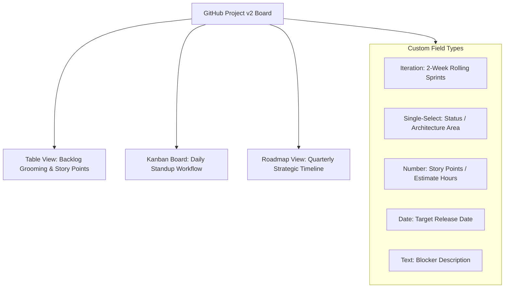

# Lesson 03: GitHub Projects v2 & Custom Fields Engineering

---

## 1. Learning Objective
Architect, customize, and manage modern **GitHub Projects v2** across Table, Board, and Roadmap views. Engineer **Custom Fields** (Iteration, Single-Select, Number, Date) to execute enterprise agile sprint planning and capacity estimation.

---

## 2. Why This Matters
Traditional project management tools (Jira, Asana, Monday) create friction because they are decoupled from the code, PRs, and commit history. GitHub Projects v2 embeds directly alongside your code, providing real-time data synchronization with zero manual status updating.

---

## 3. Prerequisites
- Completed [Lesson 01: GitHub Issues & Tasklists](01-github-issues-and-tasklists.md) and [Lesson 02: Labels & Milestones](02-labels-milestones-and-triage.md).
- Understanding of agile Kanban and Scrum methodologies.

---

## 4. Concept Explanation

### What is GitHub Projects v2?
GitHub Projects v2 is a flexible, spreadsheet-database hybrid built directly into GitHub. It connects issues and pull requests from multiple repositories into unified organizational views:



### The 3 Core View Types
1. **Table View**: High-density spreadsheet layout ideal for sprint backlog grooming, bulk editing, sorting by priority, and summing story point estimations.
2. **Board View (Kanban)**: Visual card columns grouped by status (`Todo`, `In Progress`, `In Review`, `Done`).
3. **Roadmap / Timeline View**: Gantt-chart timeline visualizing epics and deliverables across quarterly iterations and target dates.

### Custom Field Capabilities

| Field Type | Best Practice Use Case | Example Values |
| :--- | :--- | :--- |
| **Iteration** | Sprint cycles with automated rollover | `Sprint 1 (Oct 1 - Oct 14)`, `Sprint 2` |
| **Single Select** | Work item status, severity, layer | `Backlog`, `Ready for Dev`, `QA`, `Deployed` |
| **Number** | Fibonacci story points, hours | `1`, `2`, `3`, `5`, `8`, `13` |
| **Date** | Milestones, target deploy date | `2026-11-15` |
| **Text** | External ticket IDs, blocker notes | `Depends on Jira-4021` |

---

## 5. Mental Model: Slicing, Grouping & Aggregations

GitHub Projects v2 allows dynamic grouping and instant sum calculations:

```text
+--------------------------------------------------------------------------------+
| GROUP: Status = In Progress (3 items, Sum Story Points = 13)                   |
+----+--------------------------------------------+--------------+---------------+
| #  | Title                                      | Assignee     | Story Points  |
+----+--------------------------------------------+--------------+---------------+
| 45 | feat(auth): OAuth2 PKCE Flow               | @alice       | 8             |
| 48 | fix(db): connection pool starvation        | @bob         | 5             |
+----+--------------------------------------------+--------------+---------------+
| GROUP: Status = Ready for Review (2 items, Sum Story Points = 5)               |
+----+--------------------------------------------+--------------+---------------+
| 50 | docs: update API deployment guide          | @carol       | 2             |
| 51 | test: add e2e checkout tests               | @alice       | 3             |
+----+--------------------------------------------+--------------+---------------+
```

---

## 6. Real-World Use Case
An engineering manager runs a 15-minute weekly sprint planning session. Using a **Table View** grouped by `Iteration: Sprint 24`, the manager filters by `no:assignee`, reviews unassigned issues, assigns story points, and monitors the real-time "Sum of Story Points" aggregation to ensure the sprint does not exceed the team's 40-point capacity.

---

## 7. Official GitHub Documentation
- [GitHub Docs: About Projects](https://docs.github.com/en/issues/planning-and-tracking-with-projects/learning-about-projects/about-projects)
- [GitHub Docs: Customizing a view in your project](https://docs.github.com/en/issues/planning-and-tracking-with-projects/customizing-views-in-your-project/customizing-a-view)
- [GitHub Docs: Adding custom fields to your project](https://docs.github.com/en/issues/planning-and-tracking-with-projects/understanding-fields/about-fields)

---

## 8. Recommended High-Quality External Resource
- **Resource**: *Mastering GitHub Projects for Agile Teams* by GitHub Engineering.
- **Why it helps**: Walkthrough of setting up multi-view sprint boards and roadmap timelines.

---

## 9. Step-by-Step Demonstration

### 1. Interacting with Projects via GitHub CLI (`gh`)
```bash
# List organizational or user projects
gh project list

# View project schema and items
gh project view <project-number> --owner "<owner-name>"

# Create a draft item in a project
gh project item-create <project-number> --owner "<owner-name>" --title "Investigate GraphQL caching"
```

### 2. Slicing with Search Filters
Use advanced filter queries inside the Projects search bar:
- `is:open status:"In Progress" iteration:@current`
- `assignee:@me is:pr no:review-requested`
- `label:"priority: p0-blocker" -status:Done`

---

## 10. Hands-on Lab
Refer to [`../labs/04-issues-projects-and-automation-lab.md`](../labs/04-issues-projects-and-automation-lab.md).

---

## 11. Challenge
**Challenge**: Design a GitHub Project v2 board architecture with 4 distinct saved views: (1) **Sprint Backlog** (Table filtered by `@current` iteration), (2) **Team Kanban** (Board grouped by Status), (3) **Release Roadmap** (Timeline grouped by Target Date), and (4) **Blocker Radar** (Table filtered by `label:"priority: p0-blocker"`).

---

## 12. Common Mistakes & Gotchas
- **Mistake 1**: Forgetting to configure Iteration field rollover (e.g. leaving older sprint dates active).
- **Mistake 2**: Using raw text fields for statuses instead of Single Select (breaks Kanban column grouping).
- **Mistake 3**: Not saving view changes (clicking away without saving view filters reverts to default).

---

## 13. Professional Practices
- **Save Dedicated Views for Stakeholders**: Create an executive Roadmap view with technical columns hidden for product managers and leadership.
- **Enforce Story Point Estimation**: Use the Number field with Fibonacci sequence (`1, 2, 3, 5, 8, 13`) to gauge sprint velocity.

---

## 14. Security Considerations
- **Project Visibility Permissions**: Projects v2 have independent visibility settings (Public vs. Private) separate from repository permissions. Ensure internal project roadmaps are not set to Public accidentally.

---

## 15. Interview Questions & Progression

1. **[WHAT]**: What are the primary view layouts available in GitHub Projects v2?
   - *Answer*: Table view (spreadsheet), Board view (Kanban), and Roadmap view (timeline/Gantt).
2. **[HOW]**: How does the Iteration field differ from standard single-select fields?
   - *Answer*: Iterations understand chronological date ranges, support automated sprint durations (e.g. 2 weeks), and support the `@current`, `@previous`, and `@next` dynamic filter operators.
3. **[WHY]**: Why is grouping and aggregation in Table views critical for agile sprint planning?
   - *Answer*: It allows teams to see capacity distribution by assignee or sprint and instantly sum numerical fields (like Story Points or hours).
4. **[WHAT IF]**: What happens to project cards when the underlying issue is transferred to another repository?
   - *Answer*: The project item automatically updates its link to the new repository location without losing custom field values.
5. **[TRADE-OFFS]**: What are the trade-offs of using GitHub Projects v2 vs external tools like Jira?
   - *Answer*: GitHub Projects provides native, zero-latency sync with commits, PRs, and branch rulesets; Jira offers more legacy enterprise reporting plugins at the cost of integration lag.

---

## 16. Real-World Scenario
A distributed team of 20 engineers used GitHub Projects v2 for their sprint. By creating a custom **Iteration Field** set to 2-week rolling sprints and filtering the board by `iteration:@current`, every developer's daily standup board showed strictly current active tasks. When the sprint ended, the project rolled over to `@current` automatically with zero administrative overhead.

---

## 17. Assessment
Complete the evaluation in [`../assessments/04-issues-projects-assessment.md`](../assessments/04-issues-projects-assessment.md).

---

## 18. Mastery Criteria
- [ ] Understands the 3 core Projects v2 views (Table, Board, Roadmap).
- [ ] Configures Custom Fields (Iteration, Single-Select, Number, Date).
- [ ] Fluently filters and groups project items with dynamic operators (`@current`, `@me`).
- [ ] Builds capacity estimation models using field sum aggregations.

---

## 19. Further Exploration
- Explore GitHub GraphQL API mutations for bulk-updating Projects v2 fields.
- Learn about GitHub Projects Insights and velocity charts.
