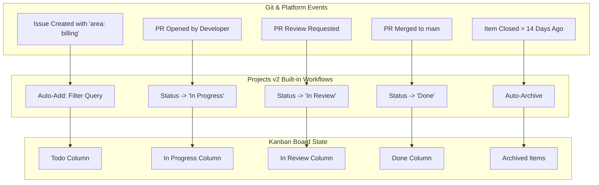
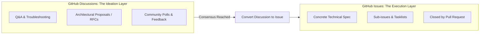

# Lesson 04: Project Automations & Cross-Repository Delivery Boards

---

## 1. Learning Objective
Configure **Built-in Project Automations** in GitHub Projects v2 (Auto-Add, Auto-Archive, status state machines), architect **Cross-Repository Delivery Portfolios**, and master the boundary between **GitHub Discussions** and **GitHub Issues**.

---

## 2. Why This Matters
Manual project tracking fails because developers forget to drag cards across Kanban columns when opening PRs or merging code. Built-in GitHub Project automations keep delivery boards 100% accurate in real-time by syncing card statuses directly to Git pull request lifecycle events across dozens of repositories.

---

## 3. Prerequisites
- Completed [Lesson 03: GitHub Projects v2 & Custom Fields](03-github-projects-v2-and-custom-fields.md).
- Understanding of Pull Request review states and organization permissions.

---

## 4. Concept Explanation

### Built-in Automated Workflows in Projects v2
GitHub Projects v2 includes a native automation engine operating directly on platform events without requiring external webhooks:



### The 5 Core Built-in Automations
1. **Auto-Add Items**: Automatically adds issues or PRs to the project if they match a specific search query (e.g. `is:issue label:"team: core"`).
2. **Item Added $\to$ Set Status**: Automatically sets newly added cards to `Todo` (or `Backlog`).
3. **Pull Request Created $\to$ Set Status**: Automatically moves linked issues and PRs to `In Progress`.
4. **Pull Request Review Requested $\to$ Set Status**: Automatically transitions cards to `In Review`.
5. **Item Closed / Merged $\to$ Set Status**: Automatically transitions cards to `Done`.
6. **Auto-Archive**: Automatically archives items that have been in `Done` for more than 7, 14, or 30 days to keep boards performant.

---

### GitHub Discussions vs. GitHub Issues



- **Discussions (Unstructured / Ideation)**: No assignees, no milestones, no closing PRs. Used for exploring ideas, community Q&A, and RFC feedback.
- **Issues (Structured / Execution)**: Discrete, actionable engineering tasks assigned to specific engineers, scheduled into sprints, and closed when code merges.

---

## 5. Mental Model: Cross-Repository Organization Portfolios

In an enterprise organization managing 30 microservices, a single **Organization-Level Project** aggregates issues across all 30 repositories into a single unified dashboard:

```text
ORGANIZATION PORTFOLIO: E-Commerce Platform Release v2.0
├── Repo: auth-service        -> Issue #84 (JWT Auth)       -> Status: Done
├── Repo: payment-gateway     -> Issue #112 (Stripe SDK)    -> Status: In Review
├── Repo: web-frontend        -> Issue #304 (Checkout UI)   -> Status: In Progress
└── Repo: infra-terraform     -> Issue #45 (Redis Cluster)  -> Status: In Progress
```

---

## 6. Real-World Use Case
An engineering lead configures a project board for a 5-repo microservice architecture. When a frontend developer opens a PR in `web-app` with description `Fixes auth-service#84`, GitHub's automated project workflow transitions the card from `Todo` to `In Progress` in the shared org board. When the PR is reviewed and merged, the card automatically transitions to `Done` across all views with zero manual intervention.

---

## 7. Official GitHub Documentation
- [GitHub Docs: Using built-in automations in Projects](https://docs.github.com/en/issues/planning-and-tracking-with-projects/automating-your-project/using-built-in-automations)
- [GitHub Docs: Adding items automatically](https://docs.github.com/en/issues/planning-and-tracking-with-projects/automating-your-project/adding-items-automatically)
- [GitHub Docs: About discussions](https://docs.github.com/en/discussions/collaborating-with-your-community-using-discussions/about-discussions)

---

## 8. Recommended High-Quality External Resource
- **Resource**: *Automating GitHub Projects with Built-in Workflows* by GitHub Enterprise Guides.
- **Why it helps**: Step-by-step visual configuration of cross-repo status triggers and auto-archival policies.

---

## 9. Step-by-Step Demonstration

### 1. Converting a GitHub Discussion to an Issue
1. Navigate to a community Discussion thread where an architectural design has reached consensus.
2. In the right-hand sidebar, click **Create issue from discussion**.
3. GitHub automatically pre-populates the issue title, links back to the original discussion thread, and preserves the conversation context.

### 2. Configuring Auto-Add Workflows in Projects v2
1. In your Project, click the **...** menu $\to$ **Workflows**.
2. Select **Auto-add to project**.
3. Define the query filter: `is:issue label:"area: billing" is:open`.
4. Enable the workflow.
*Result*: Every new issue opened with `area: billing` across any organizational repository is instantly added to this project board!

---

## 10. Hands-on Lab
Refer to [`../labs/04-issues-projects-and-automation-lab.md`](../labs/04-issues-projects-and-automation-lab.md).

---

## 11. Challenge
**Challenge**: Configure an organization project workflow where any Pull Request that receives an **Approved** review automatically transitions to a custom status column called `Ready for Deployment`.

---

## 12. Common Mistakes & Gotchas
- **Mistake 1**: Creating issues for general questions instead of Discussions. (*Result: Inflated open issue count and noisy sprint velocity metrics.*)
- **Mistake 2**: Misconfiguring Auto-Add filters (e.g. omitting `is:open`, causing thousands of historical closed issues to flood the project board).
- **Mistake 3**: Creating duplicate project boards per repository instead of a unified organization-level board.

---

## 13. Professional Practices
- **Enable Auto-Archive (30 Days)**: Always enable Auto-Archive for closed items to keep project board queries fast and focused on active work.
- **Use Discussions for RFCs**: Post Request for Comments (RFCs) in Discussions with category `RFCs & Design` before opening implementation issues.

---

## 14. Security Considerations
- **Organization Project Sharing**: Ensure that organization-level project boards do not inadvertently leak private repository issue titles if the Project board is set to Public.

---

## 15. Interview Questions & Progression

1. **[WHAT]**: What are built-in automated workflows in GitHub Projects v2?
   - *Answer*: Native rules that automate project item additions, archival, and status transitions triggered by issue and PR lifecycle events.
2. **[HOW]**: How do you keep a project board from becoming cluttered with hundreds of completed cards?
   - *Answer*: Enable the built-in **Auto-archive** workflow to automatically archive items in `Done` after 7, 14, or 30 days.
3. **[WHY]**: When should an engineering team use GitHub Discussions instead of GitHub Issues?
   - *Answer*: Use Discussions for open-ended brainstorming, community Q&A, and RFC design proposals; use Issues for discrete, actionable, assignable engineering tasks.
4. **[WHAT IF]**: What happens when a discussion is converted into an issue?
   - *Answer*: GitHub creates a new issue pre-linked to the discussion, preserving the discussion thread and history.
5. **[TRADE-OFFS]**: What are the trade-offs of using Project built-in workflows vs. custom GitHub Actions?
   - *Answer*: Built-in workflows are instant, zero-code, and managed in UI; custom GitHub Actions provide complete scripting flexibility at the cost of authoring and maintaining YAML workflow files.

---

## 16. Real-World Scenario
A fintech startup with 8 repositories previously spent 4 hours every Friday manually moving Jira tickets. By consolidating onto an **Organization GitHub Project** with **Built-in Workflows**, all card movements became 100% automated based on PR events (`Opened` $\to$ `In Progress`, `Review Requested` $\to$ `In Review`, `Merged` $\to$ `Done`), saving the team 200 engineering hours per year.

---

## 17. Assessment
Complete the evaluation in [`../assessments/04-issues-projects-assessment.md`](../assessments/04-issues-projects-assessment.md).

---

## 18. Mastery Criteria
- [ ] Configures native project workflows (Auto-Add, Status Triggers, Auto-Archive).
- [ ] Understands when to use Discussions vs Issues.
- [ ] Designs cross-repository project tracking portfolios.
- [ ] Converts discussions to actionable issues seamlessly.

---

## 19. Further Exploration
- Explore GitHub GraphQL API Projects v2 event webhooks (`projects_v2_item`).
- Learn about GitHub Discussions categories and voting mechanics.
