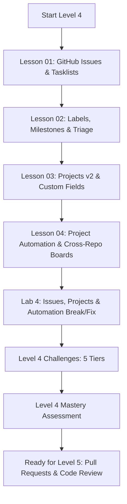
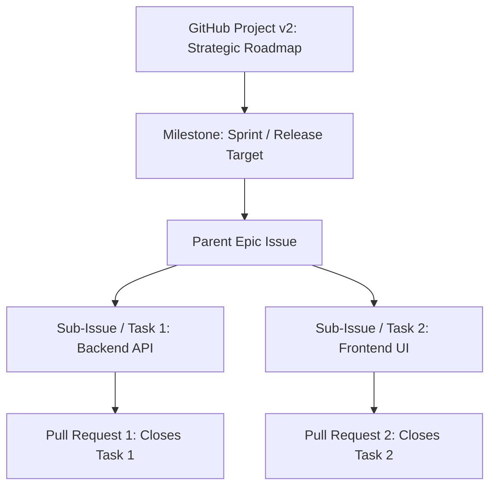

# Level 4 — Issues, Projects & Collaboration

> **Master agile engineering workflows on GitHub: architect issues, tasklists, label taxonomies, milestones, GitHub Projects v2, and automated cross-repository delivery boards.**

---

## 🎯 Level Objectives

By the end of this level, you will:
1. Master the **GitHub Issues** lifecycle: tasklists, sub-issue parent-child hierarchies, cross-linking, issue pinning, locking, transferring, and automated closing keywords (`Closes #123`, `Fixes #123`).
2. Design professional **Label Taxonomies** (type, status, priority, area) and configure sprint **Milestones** with due dates and burndown tracking.
3. Build and customize **GitHub Projects v2**: Table views, Kanban boards, Roadmap timelines, and Custom Fields (Iteration, Single-Select, Number, Date).
4. Configure **Built-in Project Automations**: Auto-add items, auto-archive, and automatic status transitions based on PR and issue events.
5. Differentiate between **GitHub Discussions** (ideation, Q&A, RFCs) and **GitHub Issues** (actionable engineering tasks).

---

## 🗺️ Module Curriculum & Roadmap

### Lessons & Materials

| # | Document | Topic & Focus | Depth |
| :---: | :--- | :--- | :---: |
| **01** | [`01-github-issues-and-tasklists.md`](01-github-issues-and-tasklists.md) | Issue Lifecycle, Tasklists, Sub-Issues, Cross-Linking, Closing Keywords | Developer $\to$ Pro |
| **02** | [`02-labels-milestones-and-triage.md`](02-labels-milestones-and-triage.md) | Label Taxonomies, Milestones, Sprint Burndown, Triage Procedures | Developer $\to$ Pro |
| **03** | [`03-github-projects-v2-and-custom-fields.md`](03-github-projects-v2-and-custom-fields.md) | Projects v2 Architecture, Tables, Boards, Roadmaps, Custom Fields | Developer $\to$ Pro |
| **04** | [`04-project-automation-and-cross-repo-boards.md`](04-project-automation-and-cross-repo-boards.md) | Built-in Project Automations, Discussions vs Issues, Org Portfolios | Developer $\to$ Pro |
| **Lab** | [`../labs/04-issues-projects-and-automation-lab.md`](../labs/04-issues-projects-and-automation-lab.md) | Tasklist Hierarchy Break/Fix, Misfiring Auto-Close Keywords, Project Automations | Hands-On |
| **Chal** | [`../challenges/04-issues-projects-challenges.md`](../challenges/04-issues-projects-challenges.md) | 5-Tier Challenges (Label Schema, Sprint Planning, Triage Automation) | Tier 1–5 |
| **Quiz** | [`../assessments/04-issues-projects-assessment.md`](../assessments/04-issues-projects-assessment.md) | Project Workflow Diagnostics, State Machines & Mastery Rubric | Evaluation |

---

## 🧠 Core Mental Models in this Level

### 1. The GitHub Agile Hierarchy

### 2. Discussions vs. Issues: The Idea-to-Code Funnel
- **GitHub Discussions**: Open-ended questions, brainstorming, architectural RFCs, and community support.
- **GitHub Issues**: Actionable, discrete units of engineering work that can be assigned, estimated, scheduled, and closed with a Pull Request.

---

## ✅ Level 4 Mastery Checklist

Before advancing to [Level 5: Pull Requests & Code Review](../05-pull-requests/), verify you can:
- [ ] Construct nested markdown tasklists and track sub-issue completion percentages.
- [ ] Utilize all 9 official GitHub issue auto-closing keywords correctly across default and feature branches.
- [ ] Design a clean, scalable label taxonomy using standardized prefixes (`type:`, `priority:`, `status:`, `area:`).
- [ ] Configure a GitHub Project v2 with custom Iteration (sprint), Single-Select, and Number fields.
- [ ] Build automated project workflows that move cards to "In Progress" when a PR opens and "Done" when merged.
- [ ] Score 100% on the [Level 4 Assessment](../assessments/04-issues-projects-assessment.md).
