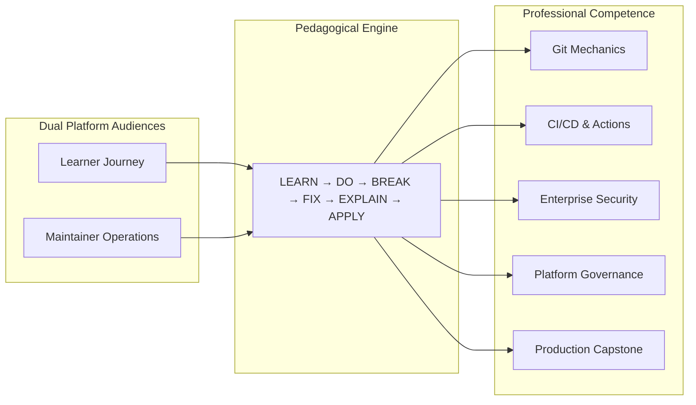

# GitHub Mastery for Developers (Zero to Hero)

> **A professional, hands-on developer training system and maintained educational repository designed to teach Git and GitHub from foundational mental models to enterprise-grade engineering workflows.**

---

## 🎯 Platform Mission & Audiences

This repository is **NOT** a collection of static notes or generic cheatsheets. It is a structured, production-grade training platform built on the **Living Repository** pattern—the repository itself demonstrates every enterprise practice it teaches.



### Explicit Target Audiences
1. **The Learner**: Developers, DevOps engineers, and students aiming to achieve complete operational mastery across Git version control, GitHub collaboration, automated CI/CD pipelines, Codespaces, security scanning, API scripting, and enterprise release management.
2. **The Maintainer**: Course authors and technical maintainers who continuously evolve, validate, and update the curriculum against GitHub's rapid platform releases, API versioning, and deprecation schedules using automated CI test harnesses.

---

## 🧭 Course Progression Tracker

```text
GitHub Mastery
━━━━━━━━━━━━━━━━━━━━━━━━━━━━━━━━━━━━━━━━━━━━━━━━━━━━━━━━━━━━━━━━━━━━━━━━━━
[x] Level 0  — Foundation & GitHub Mental Model
[x] Level 1  — Git Fundamentals (Plumbing, Porcelain & Objects)
[x] Level 2  — GitHub Repository Mastery & Hygiene
[x] Level 3  — Branching & Professional Git Workflows
[x] Level 4  — Issues, Projects & Collaboration
[ ] Level 5  — Pull Requests & Code Review Mastery
[ ] Level 6  — GitHub Actions & Enterprise CI/CD
[ ] Level 7  — Codespaces & Cloud Development Environments
[ ] Level 8  — GitHub Security & Supply Chain Defense
[ ] Level 9  — Packages, Releases & Distribution
[ ] Level 10 — GitHub CLI & Developer Productivity
[ ] Level 11 — GitHub APIs, Webhooks & Automation
[ ] Level 12 — Organizations, Teams & Enterprise Governance
[ ] Level 13 — Open Source & Maintainer Workflows
[ ] Level 14 — GitHub Copilot & AI-Native Development
[ ] Level 15 — Professional GitHub Engineering Capstone
━━━━━━━━━━━━━━━━━━━━━━━━━━━━━━━━━━━━━━━━━━━━━━━━━━━━━━━━━━━━━━━━━━━━━━━━━━
```

---

## 🗺️ 16-Level Curriculum Map

| Level | Directory | Focus & Core Skills | Depth | Status |
| :---: | :--- | :--- | :---: | :---: |
| **0** | [`00-foundations/`](00-foundations/) | Git vs GitHub Mental Model, Ed25519 SSH Auth, Commit Signing, Environment Health | Beginner $\to$ Dev | **READY** |
| **1** | [`01-git-fundamentals/`](01-git-fundamentals/) | Three-Tree Architecture, Plumbing (`cat-file`, `hash-object`), Porcelain, Dag Graphs | Beginner $\to$ Pro | **READY** |
| **2** | [`02-repositories/`](02-repositories/) | Repository Architecture, `.gitignore`, `.gitattributes`, Templates, Hygiene | Beginner $\to$ Dev | **READY** |
| **3** | [`03-branching-workflows/`](03-branching-workflows/) | Trunk-Based, GitHub Flow, Merge vs Rebase, Conflict Surgery, Reflog Rescue | Dev $\to$ Pro | **READY** |
| **4** | [`04-issues-projects/`](04-issues-projects/) | GitHub Projects v2, Issue Forms, Workflows, Milestones, Roadmaps | Dev $\to$ Pro | **READY** |
| **5** | [`05-pull-requests/`](05-pull-requests/) | PR Lifecycle, CODEOWNERS, Review Etiquette, Suggested Changes, Merge Strategies | Dev $\to$ Pro | Up Next |
| **6** | [`06-github-actions/`](06-github-actions/) | CI/CD Pipelines, Matrix Builds, Reusable Workflows, Custom Actions, Security | Dev → Pro | Queued |
| **7** | [`07-codespaces/`](07-codespaces/) | Cloud VMs, Dev Containers (`devcontainer.json`), Dotfiles, Prebuilds | Dev → Pro | Queued |
| **8** | [`08-security/`](08-security/) | Secret Scanning, Push Protection, Dependabot, CodeQL (SAST), Branch Rulesets | Dev → Pro | Queued |
| **9** | [`09-packages-releases/`](09-packages-releases/) | Semantic Versioning, GitHub Releases, Package Registry (npm/Docker/Maven) | Dev → Pro | Queued |
| **10** | [`10-github-cli/`](10-github-cli/) | `gh` CLI Scripting, Custom Extensions, Terminal Speedruns, Aliases | Dev → Pro | Queued |
| **11** | [`11-api-automation/`](11-api-automation/) | REST API v3, GraphQL API v4, Webhook Handlers, GitHub Apps Auth | Pro | Queued |
| **12** | [`12-organizations/`](12-organizations/) | Enterprise RBAC, Teams, Audit Logs, IP Allow Lists, SAML SSO | Pro | Queued |
| **13** | [`13-open-source/`](13-open-source/) | OSS Maintainership, RFCs, Upstream Triage, Contributor Governance | Dev → Pro | Queued |
| **14** | [`14-ai-development/`](14-ai-development/) | GitHub Copilot, Prompt Files, Agent Workflows, Custom Instructions, Review | Dev → Pro | Queued |
| **15** | [`15-capstone/`](15-capstone/) | End-to-End Enterprise Production Engineering Pipeline | Pro | Queued |

---

## 🧠 Core Philosophy: The Break/Fix Pedagogical Loop

Passive reading leads to fragile knowledge. This curriculum forces practical competence through deliberate failure injection:

$$\text{LEARN} \longrightarrow \text{DO} \longrightarrow \mathbf{\text{BREAK}} \longrightarrow \mathbf{\text{FIX}} \longrightarrow \text{EXPLAIN} \longrightarrow \text{APPLY}$$

1. **LEARN**: Absorb technical concepts, mental models, and architectural trade-offs.
2. **DO**: Execute hands-on labs with annotated commands.
3. **BREAK**: Intentionally trigger realistic failures (merge conflicts, detached HEAD, leaked tokens, broken workflows, permission denials).
4. **FIX**: Diagnose using root-cause analysis tools (`git reflog`, `git bisect`, `ssh -Tv`, Actions debug logs).
5. **EXPLAIN**: Synthesize *why* the failure occurred and how production systems mitigate it.
6. **APPLY**: Complete independent, multi-tier challenges without copy-paste recipes.

---

## 🛠️ Prerequisite Checklist

Before starting Level 0, ensure your environment meets the baseline requirements:

- [ ] **Git CLI**: Version `2.38+` installed (`git --version`).
- [ ] **GitHub Account**: Active account on [github.com](https://github.com) with 2FA enabled.
- [ ] **Terminal / Shell**: Bash, Zsh, or PowerShell 7+ on Linux, macOS, or Windows (WSL2 recommended).
- [ ] **Text Editor**: Modern IDE (VS Code, Cursor, or Antigravity) with Git graph visualization.
- [ ] **GitHub CLI (`gh`)**: Version `2.30+` installed (`gh --version`).
- [ ] **Docker Engine (Optional for Level 0, Required for Level 7)**: Docker Desktop or Colima for Dev Containers.

---

## 📚 Standardized Curriculum Architecture

Every major lesson in this repository adheres to a strict **19-Part Engineering Specification**:

```
 1. Learning Objective         8. Vetted External Resource    15. Interview Questions
 2. Why This Matters           9. Step-by-Step Demo          16. Real-World Scenario
 3. Prerequisites             10. Hands-on Lab               17. Level Assessment
 4. Concept Explanation       11. 5-Tier Challenge           18. Mastery Criteria
 5. Mental Model & Diagrams   12. Common Mistakes & Gotchas  19. Further Exploration
 6. Real-World Use Case       13. Professional Practices
 7. Official Documentation    14. Security Considerations
```

Every hands-on lab follows the **9-Part Lab Framework**:
`Objective` $\to$ `Prerequisites` $\to$ `Setup` $\to$ `Instructions` $\to$ `Expected Result` $\to$ `Verification` $\to$ `Troubleshooting` $\to$ `Cleanup` $\to$ `Extension Challenge`.

---

## 🚀 Getting Started

Begin with **[Level 0: Foundation & GitHub Mental Model](00-foundations/)**:
1. Read [01: Git vs GitHub Mental Model](00-foundations/01-git-vs-github-mental-model.md).
2. Read [02: Developer Environment & SSH Auth](00-foundations/02-developer-environment-ssh-auth.md).
3. Execute [Hands-On Lab 0: Environment & Auth Break/Fix](labs/00-environment-and-auth-lab.md).
4. Solve [Level 0 Challenges](challenges/00-foundations-challenges.md).
5. Verify mastery with the [Level 0 Assessment](assessments/00-foundations-assessment.md).

---

## 🤝 Contribution & Governance

We welcome contributions from learners and maintainers. Please review:
- [CONTRIBUTING.md](CONTRIBUTING.md) for curriculum authoring standards and PR checklists.
- [docs/architecture.md](docs/architecture.md) for durable platform architecture.
- [docs/conventions.md](docs/conventions.md) for style guides, templates, and formatting.
- [docs/decisions/](docs/decisions/) for Architectural Decision Records (ADRs).
