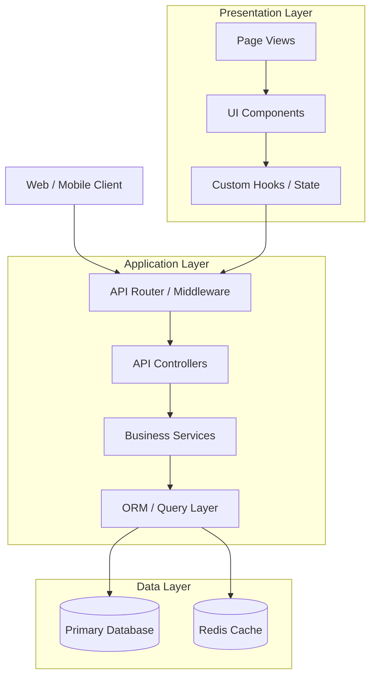
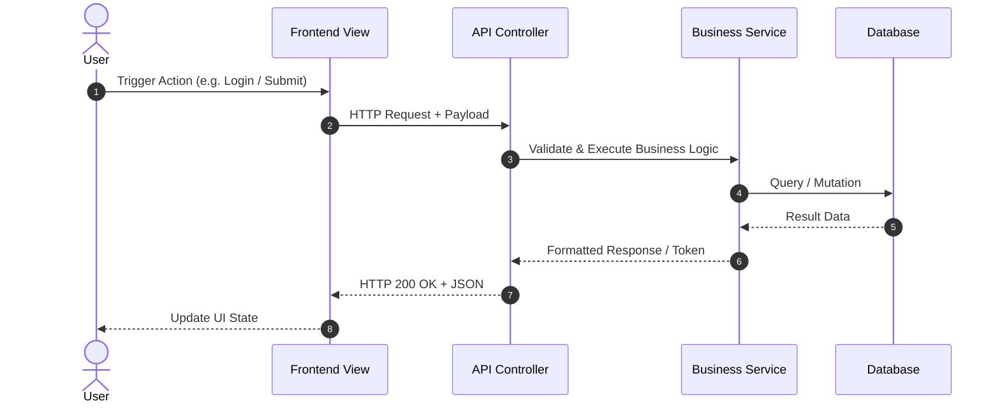
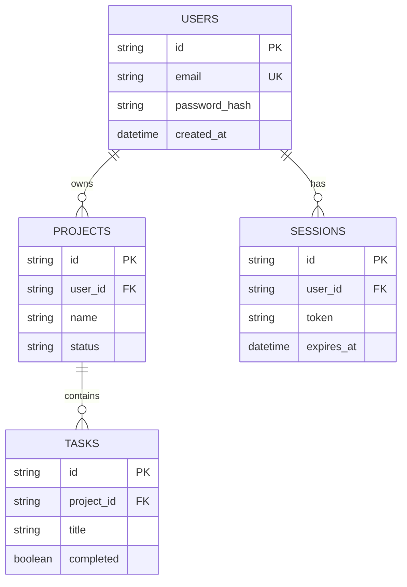

# Project Dependency & Relationship Graph

This document is the structural wiring diagram for the codebase. It maps component hierarchies, API call paths, and database relationships to enable safe refactoring and instant blast-radius analysis.

---

## 1. System Context & Component Graph

---

## 2. API Route & Call Flow Graph

---

## 3. Database Entity-Relationship (ER) Diagram

---

## 4. Blast Radius & Dependency Matrix

Use this table to check downstream impacts before modifying core shared modules:

| Core Module / File | Direct Dependents (Imported By) | Risk Level | Blast Radius Mitigation |
| --- | --- | :---: | --- |
| `src/db/schema.ts` | All Services, Migrations, Models | **HIGH** | Run typecheck & full test suite on schema edit. |
| `src/middleware/auth.ts` | All Protected API Routes | **HIGH** | Verify token expiration & authorization test cases. |
| `src/components/ui/Button.tsx` | All Page Views, Modal Dialogs | **MEDIUM** | Check visual styling & disabled states. |
| `src/utils/formatters.ts` | Dashboard, Table Components | **LOW** | Unit test input/output edge cases. |
