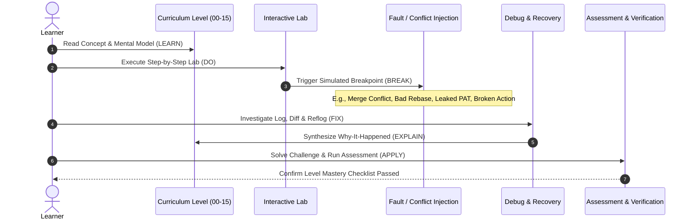
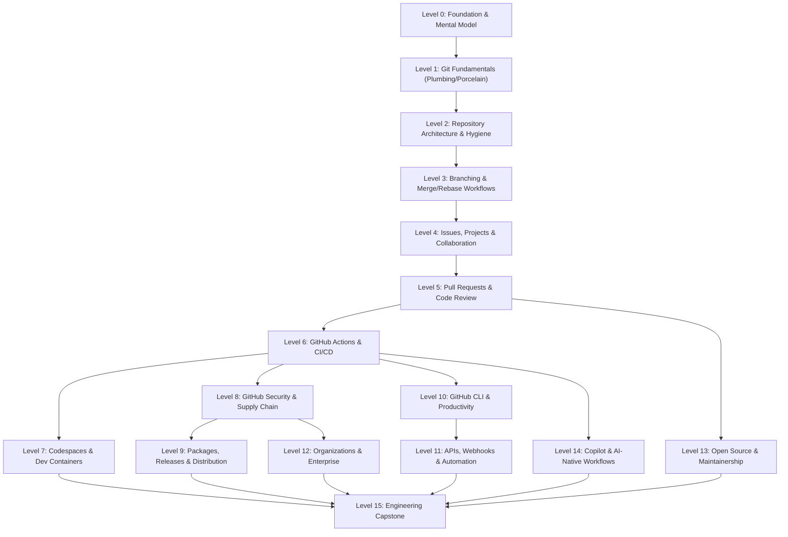

# Project Dependency & Relationship Graph

This document is the structural wiring diagram for the **GitHub Mastery for Developers (`github-zero-to-hero`)** platform. It maps curriculum hierarchies, pedagogical flows, prerequisite paths, and blast radius matrices.

---

## 1. System & Curriculum Architecture Graph

```mermaid
graph TD
    Root[github-zero-to-hero] --> Gov[Governance & Docs]
    Root --> Curr[16-Level Curriculum]
    Root --> HandsOn[Hands-on Engine]
    Root --> GHMeta[Meta-Learning Infrastructure]

    subgraph Gov [Governance & Docs]
        Gov --> ArchDoc[docs/architecture.md]
        Gov --> ConvDoc[docs/conventions.md]
        Gov --> AgentsDoc[AGENTS.md & GEMINI.md]
        Gov --> TaskState[docs/task-state.md]
    end

    subgraph Curr [Curriculum Progression: 00-15]
        L0[00-foundations] --> L1[01-git-fundamentals]
        L1 --> L2[02-repositories]
        L2 --> L3[03-branching-workflows]
        L3 --> L4[04-issues-projects]
        L4 --> L5[05-pull-requests]
        L5 --> L6[06-github-actions]
        L6 --> L7[07-codespaces]
        L6 --> L8[08-security]
        L8 --> L9[09-packages-releases]
        L6 --> L10[10-github-cli]
        L10 --> L11[11-api-automation]
        L8 --> L12[12-organizations]
        L5 --> L13[13-open-source]
        L6 --> L14[14-ai-development]
        L0 & L1 & L2 & L3 & L4 & L5 & L6 & L7 & L8 & L9 & L10 & L11 & L12 & L13 & L14 --> L15[15-capstone]
    end

    subgraph HandsOn [Hands-On Ecosystem]
        Labs[labs/ - Interactive Labs]
        Challenges[challenges/ - 5-Tier System]
        Assessments[assessments/ - Mastery Checks]
        Cheatsheets[cheat-sheets/ - Fast Ref]
    end

    subgraph GHMeta [Meta-Learning GitHub Ops]
        Workflows[.github/workflows/ - CI/CD]
        Templates[.github/ISSUE_TEMPLATE & PR_TEMPLATE]
        Codeowners[.github/CODEOWNERS]
        Dependabot[.github/dependabot.yml]
    end

    Curr -.-> Labs
    Curr -.-> Challenges
    Curr -.-> Assessments
```

---

## 2. Pedagogical Learning & Recovery Loop (Sequence)



---

## 3. Curriculum Prerequisite Dependency Graph



---

## 4. Blast Radius & Dependency Matrix

Use this matrix to assess downstream impact before modifying shared modules, schemas, or level prerequisites:

| Module / Component | Direct Dependents | Risk Level | Blast Radius Mitigation Strategy |
| :--- | :--- | :---: | :--- |
| `docs/conventions.md` | All 16 levels, all labs, assessments | **CRITICAL** | Review lesson template changes against existing modules before widespread adoption. |
| `docs/architecture.md` | Course roadmap, directory structure | **HIGH** | Log architectural updates in `docs/decisions/` ADR before restructuring. |
| `AGENTS.md` / `GEMINI.md` | All agentic assistants & automation | **HIGH** | Maintain backward compatibility of learned rules and operating procedures. |
| `00-foundations/` | Levels 01 through 15 | **HIGH** | Ensure core mental models (working tree, staging, object DB) remain aligned across later labs. |
| `01-git-fundamentals/` | Levels 02 through 15 | **HIGH** | Verify command syntax and plumbing/porcelain distinction before altering base labs. |
| `06-github-actions/` | Levels 07, 08, 09, 10, 11, 14, 15 | **HIGH** | Validate action syntax against GitHub runner versions and SHA pinning. |
| `.github/workflows/` | Entire repository CI/CD & validation | **MEDIUM** | Test workflow triggers locally with `act` or in dedicated test branches. |
| `labs/` (Shared helpers) | Individual level lab exercises | **MEDIUM** | Run lab verification test scripts before committing changes to helper utilities. |
| `assessments/` (Rubrics) | Individual level completion tracking | **LOW** | Verify rubric criteria map directly to the 19-part lesson mastery checklist. |

